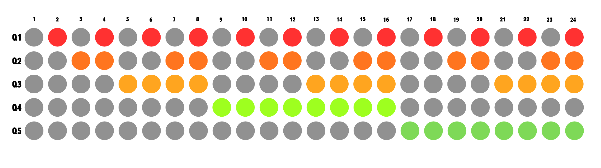

# proyecto-02

## Grupo

Número de grupo: 02

Tema del grupo: Secuenciador 

Integrantes:

- Isidora Alvarez / isidoraalvarez
- Dayana Pañitrur / dayanapanitrur
- Camila Ramirez / Estrabismx
- Angel Sabogal / angel-udp
- Tomas Catrileo / tomascatri
  
## Circuito 1 v01: Contador binario - CD4040

### Descripción general/conceptual 1

¿Qué hace el circuito? Intentar explicarlo para gente que no sabe electrónica. Ejemplo: escucha los impactos sobre sí mismo y lo convierte en señales de aviso para otras cosas

Este circuito se categoriza como un secuenciador, es decir que genera corrientes eléctricas en un patrón repetitivo y ordenado. Un ejemplo de esto es un semáforo, ya que se va a prender siempre en el mismo orden:

_VERDE > AMARILLO > ROJO > VERDE > AMARILLO > ROJO > ..._


<br>

### Descripción de funcionamiento 1

Preguntas orientadoras: ¿Qué inputs recibe? ¿Qué outputs entrega? ¿Cómo administra los flujos de inputs a outputs internamente? ¿Qué componente es el "corazón/cerebro"? ¿Qué truco descubrimos en el camino? ¿Especulativamente, qué se podría conectar a este módulo en el futuro?

<br>

Ya definimos que este sistema es un secuenciador, pero algo importante es como está configurada la duración de cada _activación_. Tal como en los semáforos no todos los colores duran lo mismo, en este circuito cada _señal_ tiene una duración única. ¿A que se refiere "duración unica"? En que cada _señal_ está asociada a un número, desde el 0 al 12 y mientras menor sea el número asociado, más rapido se va a _activar_. A continuación se puede observar una representación de este patrón



> De izquierda a derecha: Avance del tiempo
>
> De arriba a abajo: Q1, Q2, Q3, Q4 y Q5 = Canales

<br>

Esta es una secuencia binaria y de las cosas más notorias es que cada _canal_ tiene la misma duración prendido y apagado, es decir, el Q3 funciona con 4 _señales apagadas_ y 4 _señales prendidas_. Otro punto interesante es como esta duración tambien sigue un patrón

| Canal / Step | Duración   |
| ------------ | ---------- |
| Q1           | 1 tiempo   |
| Q2           | 2 tiempos  |
| Q3           | 4 tiempos  |
| Q4           | 8 tiempos  |
| Q5           | 16 tiempos |

<br>

Ahora que entendemos como funciona su secuencia, vamos a profundizar más en como este circuito logra generar este proceso. Anteriormente se mencionó (y tmabien se ejemplificó en la imagen) que en cada _"tiempo"_ se van _activando_ las señales correspondientes, estos "_tiempos_" son corrientes eléctricas, es decir, que se necesita una señal intermitente y constante para activar el proceso de conteo. Esto es conocido como **reloj** o **clock**, entonces la velocidad con la que alterne este circuito afectará en como nuestro secuenciador realice su conteo.

Para una mayor compresión se utilizará la siguiente analogía: Tenemos una especie de corazón (Reloj) que cada vez que late (emitir un pulso eléctrico) un semáforo prende sus luces (se activan las salidas del secuenciador)

>Clickear imagen para reproducir video

[](https://youtube.com/shorts/x3a4tAwtNEM?feature=share)


### Esquemático 


### PCB 1


### Documentación audiovisual funcionamiento protoboard 1

Clickear imagenes para reproducir video

[](https://youtu.be/7QSAAqquWV8)

[](https://youtu.be/X4rYO5dJ6EY)

[](https://youtu.be/25J13NA67AE)

<br>

## Circuito 2

Circuito 2 v01:  registro de desplazamiento estático - CD4015

### Descripción general/conceptual 2

¿Qué hace el circuito? Intentar explicarlo para gente que no sabe electrónica. Ejemplo: escucha los impactos sobre sí mismo y lo convierte en señales de aviso para otras cosas

Este circuito también se categoriza como un secuenciador, es decir, que genera corrientes eléctricas en un patrón repetitivo y ordenado. Podemos tomar el mismo ejemplo del semáforo mencionado en el circuito anterior, donde este funciona encendiendo un LED detrás del otro sucesivamente hasta que se repite el ciclo.


### Descripción de funcionamiento 2

Preguntas orientadoras: ¿Qué inputs recibe? ¿Qué outputs entrega? ¿Cómo administra los flujos de inputs a outputs internamente? ¿Qué componente es el "corazón/cerebro"? ¿Qué truco descubrimos en el camino? ¿Especulativamente, qué se podría conectar a este módulo en el futuro?

¿Qué inputs recibe?
Recibe una señal de reloj (clock), que son pulsos eléctricos que le indican cuándo debe avanzar al siguiente paso de la secuencia puede venir de un chip NE555.

¿Qué outputs entrega?
Entrega señales eléctricas en sus distintas salidas (Q1, Q2, Q3, ..., Q8), activando una salida tras otra en orden.

¿Cómo administra los flujos de inputs a outputs internamente?
Cada vez que llega un pulso del reloj "del chip 555", el CD4015 mueve la información al siguiente paso.

¿Qué componente es el corazón o cerebro?
El componente principal es el chip CD4015, ya que es el encargado de guardar y mover la información entre sus salidas siguiendo el ritmo del reloj.

¿Qué truco descubrimos en el camino?
Se cambio la resistencia del 555 de 1k a 15k y logramos hacer el circuito mas estable.

¿Qué se podría conectar a este módulo en el futuro?
Se podrían conectar LEDs, sintetizadores, relés, motores o cualquier circuito que necesite activarse siguiendo una secuencia automática.

### Esquemático 2


### PCB 2

```markdown

```

```markdown

```

### Documentación audiovisual funcionamiento protoboard 2

Incluir enlace a video en youtube (puede estar en Oculto) con protoboard funcionando

## Otros circuitos

¿Usaron otro circuito temporal para activar algunas cosas? ¿para probar inputs-outputs? Detallar cuales

## Colaboración con otros grupos

### ¿Cómo ayudé a otro grupo?

Lorem ipsum

### ¿Cómo me ayudó otro grupo?

lorem ipsum

## Bibliografía

