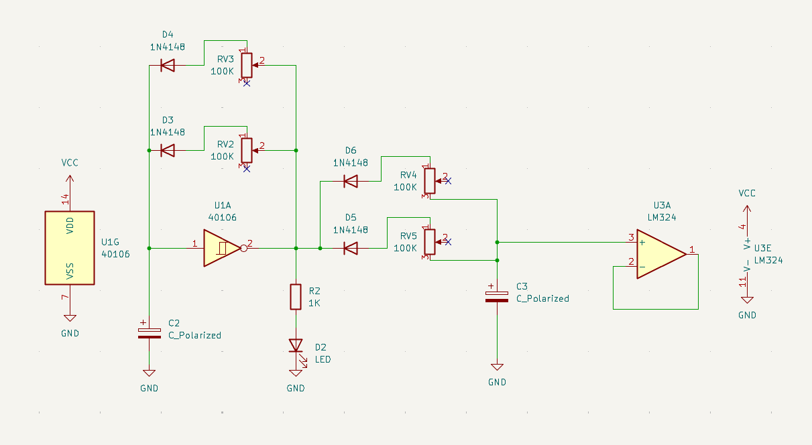
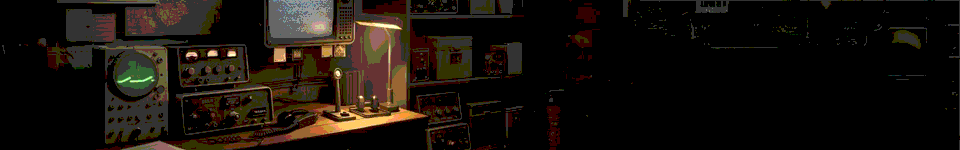
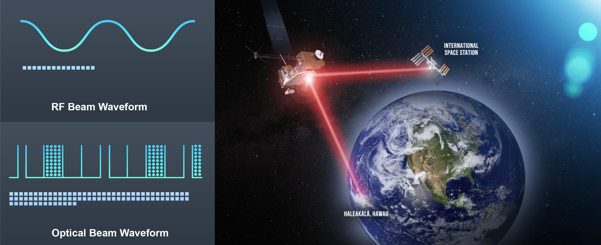

# proyecto-02

## Grupo

Número de grupo: **04**

Tema del grupo: **Oscilador 2**

***Integrantes:***

> *Paula Fuentes Mena (paulafuentesm)*
&nbsp;&nbsp;&nbsp;&nbsp;&nbsp;&nbsp;&nbsp;&nbsp;&nbsp;&nbsp;&nbsp;&nbsp;&nbsp;&nbsp;&nbsp;&nbsp;
*Santiago Cifuentes Vélez (santiagocifuvelez)*&nbsp;&nbsp;&nbsp;&nbsp;&nbsp;&nbsp;&nbsp;&nbsp;&nbsp;&nbsp;&nbsp;&nbsp;&nbsp;&nbsp;&nbsp;&nbsp;   
*Kristel Ladrón de Guevara Jara (kristelagj)*&nbsp;&nbsp;&nbsp;&nbsp;&nbsp;&nbsp;&nbsp;&nbsp;&nbsp;&nbsp;&nbsp;&nbsp;&nbsp;&nbsp;&nbsp;&nbsp;Yaira Alexandra Ruiz Ossandón / *(yairaruiz)* &nbsp;&nbsp;&nbsp;&nbsp;&nbsp;&nbsp;&nbsp;&nbsp;&nbsp;&nbsp;&nbsp;&nbsp;&nbsp;&nbsp;&nbsp;&nbsp;   Catalina Anatonia Oyanedel Sanchez / *(catalinaoyanedel-01)* &nbsp;&nbsp;&nbsp;&nbsp;&nbsp;&nbsp;&nbsp;&nbsp;&nbsp;&nbsp;&nbsp;&nbsp;&nbsp;&nbsp;&nbsp;&nbsp;Antonella Kiara Aguilar Plate / *(antokiaraa)*

## Propuesta 01: Chirihue Mecanizado

*"Desembarcando en Riñihue*

*Se vio la Violeta Parra*

*Sin cuerdas en la guitarra*

*Sin hojas en el coligüe*

*Una banda de chirigües*

*Le vino a dar un concierto"*

— Violeta Parra 

### Descripción general/conceptual

- Nuestro circuito es un oscilador, el cual tiene la función de generar la forma de la onda que luego se convertirá en sonido. El Chirihue Mecanizado lleva su nombre gracias al parecido con el canto de este pájaro, quien tiene una melodía particular, donde repite sonidos extremadamente cortos y agudos de manera continua, y va oscilando/variando, de cierta forma, en la tonalidad y en el ritmo. Esta propuesta lleva su apellido “Mecanizado” ya que nuestros sonidos se encuentran limitados por la condición de la máquina, y aunque quisiéramos, no podríamos imitar su canto original que está creado por la naturaleza. Por lo tanto, esta es nuestra reinterpretación de su voz.

### ¿Cómo funciona?

- Nuestro circuito está compuesto por los chips 40106 y LM324, los cuales nos permiten crear un oscilador simple y experimental. Este tipo de circuito nos posibilita generar una onda cuadrada, pero al producir variaciones de attack y decay (ataque y decaimiento), se puede acercar al sonido de una onda de sierra o triangular.

#### ¿Qué es el ataque y el decaimiento?

- Estos conceptos vienen de las siglas ADSR, las cuales significan Attack (Ataque), Decay (Decaimiento), Sustain (Sostenimiento) y  Release (Liberación). Esta es una de las herramientas más fundamentales para moldear cómo se comporta un sonido a lo largo del tiempo. Nuestra propuesta sólo abarca los primeros dos pasos de esta secuencia.

  - ***Ataque:***
     Es el tiempo que tarda en aparecer la nota, se puede interpretar como un “fade in”.

  - ***Decaimiento:***
    Usualmente, debería ser el tiempo que se tarda en alcanzar el nivel de sostenimiento después del ataque. En nuestro caso, como no tiene el paso del sostenimiento del sonido, este funciona como el tiempo que tarda en desvanecerse progresivamente hasta el silencio, después de que finalice el ataque. Se puede interpretar como un “fade out”.

### Descripción de funcionamiento

- Chirihue Mecanizado es un circuito que consta de su corazón, el chip CD40106, el cual es un inversor Schmitt Trigger. Este varía su salida entre 0 y 1 según el voltaje (9V), regulado por los condensadores C2 y C3, los diodos controlan la dirección para después **variar sus velocidades en los potenciadores RV2 y RV3,** donde después salen ondas cuadradas de estos, **siendo modificadas por los potenciadores RV4 (Ataque) y RV5 (Decaimiento).**

#### ¿Cómo trabaja esto internamente?

- El condensador C2 comienza a cargarse a través de los potenciómetros RV2 y RV3. Cuando el voltaje alcanza el umbral superior del CD40106, la salida del chip cambia de estado. Luego, el condensador se descarga hasta alcanzar el umbral inferior, momento en el que el chip vuelve a cambiar de estado, generando la oscilación.    Los diodos D3 y D4 permiten que la carga y descarga del condensador ocurran por caminos distintos, mientras que los potenciómetros RV2 y RV3 controlan la velocidad de las ondas. Al modificar esta velocidad, cambia la frecuencia de la oscilación y, por lo tanto, el tono del sonido.    La señal producida por el CD40106 luego pasa por una segunda etapa formada por los diodos D5 y D6, los potenciómetros RV4 y RV5 y el condensador C3. Esto permite modificar el comportamiento de la señal (ondas de sierra) antes de enviarla al LM324 para amplificarlo, funcionando como seguidor de voltaje para entregar una salida estable (OUT) al resto del circuito y generando el sonido del chirihue.

### Esquemático 1

### PCB 1

### Documentación audiovisual funcionamiento protoboard 1

<https://youtube.com/shorts/mDQom4hty6A?si=wljWdzG3RVMwezJX>

_____________________________________________________________________

## Propuesta 02: Comunicaciones espaciales

*Espacio, miles de kilómetros de espacio,*

*y voces vibrando en su centro.*

*Ningún hombre al alcance de la vista,*

*sólo las ondas de radio se agitaban*

*tratando de emocionar a otros hombres.*

—Calidoscopio - Ray Bradbury

*imagen: Schauer, K. (2021)*

### Descripción general/conceptual

- El sonido generado por el oscilador puede asemejarse al de una llamada o transmisión espacial dependiendo de cómo se regulan las ondas. El chip CD40106 tiene una compuerta inversora o Schmitt Trigger; si la entrada está en 0, la salida pasa a 1 y cuando la entrada está en 1, la salida pasa a 0.    Básicamente mantienen una constante comunicación para poder generar el sonido, igualando la recepción constante de señales entre la Tierra y el espacio. Somos las comunicaciones espaciales desde la tierra (humanos monitoreando la “llamada” hacia objetos en el espacio, como nosotros estamos mandando una señal mediante el potenciador/chip para así poder realizar la señas y sea audible al resto).

**¿Qué hace el circuito?**

- El funcionamiento del **CD40106** lo utilizaremos  comparándolo con una conversación entre la Tierra y una nave espacial.    La resistencia y el condensador son una estación terrestre que espera la respuesta de la nave (energía). La salida está en alto, cuando la Tierra envía una señal de radio al espacio. Mientras la señal "viaja", el condensador se carga poco a poco. Cuando alcanza cierto nivel, el CD40106 cambia su salida, como si la nave hubiera respondido al mensaje.                                                                                                                                    Cuando la señal alcanza el umbral superior del Schmitt Trigger, es cuando la nave hubiera recibido el mensaje y respondiera. En ese momento, la salida cambia a bajo, es aqui cuando comienza la segunda parte del viaje: el condensador se descarga para dar la señal de respuesta viajando de vuelta hacia la Tierra.
Cuando el nivel baja lo suficiente, el CD40106 vuelve a cambiar su salida y se envía un nuevo mensaje. Este proceso se repite continuamente, generando una oscilación entre estados altos y bajos que produce una señal de audio, similar a una conversación constante entre la Tierra y una nave espacial.

### Descripción de funcionamiento

 - Comunicaciones Espaciales utiliza un chip CD40106 que es un inversor Schmidt Trigger, esto significa que contiene 6 inversores Schmitt Trigger independientes (si la entrada está en bajo (0), la salida está en alto (1) y viceversa) recibiendo un voltaje de 9v.

#### ¿Cómo trabaja todo esto internamente?

 - Todo esto está en un ciclo continuo. Primero la salida del inversor está cargando lentamente el condensador a través de la resistencia. Cuando el voltaje que está en el condensador alcanza un umbral superior, el chip CD40106 cambiará su estado pasando la salida estar en 0, el condensador comienza a descargarse hasta llegar al umbral inferior haciendo que el inversor cambie de estado.     Todo esto indefinido, puede realizarse las veces que estimes. En resumidas cuentas, el condensador acumula la energía, el CD40106 llega a un umbral determinado que es su límite, cambia de estado y el ciclo vuelve a comenzar (oscilando). Esto nos da a entender que el corazón de Comunicaciones Espaciales es el chip CD40106, ya que sin él no podría decidir cuándo cambiar entre 0 y 1, detectar el nivel de los condensadores y generar la onda cuadrada emitida hacia el parlante.    De este oscilador como grupo decidimos seguirlo paso a paso, pero fuimos cambiando los condensadores entre 100 uf a 1 uf, para así poder hacer la onda más rápida y hacerlo más agudo según como se mueven los potenciadores.     A veces la frecuencia alcanzada generó tonos tan intensos y agudos que llegaron a resultar molestos e incluso provocar dolor de cabeza verificados por experiencias propias.     A este oscilador en un futuro, le podemos añadir un secuenciador chip CD4040 que es un contador binario de 12 pasos. Desde el 40106 tendrá un input de onda cuadrada y un output con el 4040 de múltiples ondas cuadradas a distintas velocidades.

### Esquemático 2

### PCB 2

### Documentación audiovisual funcionamiento protoboard 2

<https://youtube.com/shorts/frkgmTlf4B8?si=f_mIFur9-M_zVIRZ>

_____________________________________________________

## Otros circuitos

**¿Usaron otro circuito temporal para activar algunas cosas? ¿para probar inputs-outputs? Detallar cuales**

- Sí, para probar las salidas de las dos propuestas, se utilizó el circuito potenciador señalado en el proyecto 01, basado en el amplificador LM386. La señal generada por el oscilador es enviada al potenciador, permitiendo amplificarla y reproducirla mediante un parlante para verificar su funcionamiento.     En este caso, no fue necesario utilizar un circuito de una entrada inputs, ya que el chip CD40106 recibe en el pin 1 una señal generada por el propio circuito mediante una realimentación desde la salida, a través de una red de resistencias y condensadores. Este mecanismo permite que el circuito oscile de forma autónoma y produzca una señal de audio.     Mientras que la señal OUT, fue conectada a la entrada del circuito al potenciador mediante un potenciómetro de 100 kΩ conectado a la pin 1,  que permitía regular el nivel de señal ( volumen ). La salida del LM386 fue conectada a un parlante, permitiendo escuchar la señal generada y verificar el correcto funcionamiento del sistema.

## Colaboración con otros grupos
### ¿Cómo ayudé a otro grupo?

- El servicio y la ayuda de nuestro grupo, se vió reflejado en la solidaridad de ir a la locación de San Diego, en la parte central de la ciudad, para comprar los elementos que cada grupo requería (el grupo 01, 02, y 03) y así mismo iniciar los procesos de materialización de los circuitos. Además, junto al grupo 03 (osciladores 1), estuvimos en constante conversación para saber que tipos de chips estaban haciendo y cómo iban evolucionando con su trabajo.

### ¿Cómo me ayudó otro grupo?

- El grupo 03 (osciladores 01), nos ayudó prestandonos 2 potenciómetros que se nos habían dañado. También, Carla, integrante del grupo 06, nos enseñó en la sala de clases como importar una librería de huellas (que serían los estándares generales para la entrega de la solemne 02).

## Bibliografía

- ZAK Sound. (2021, 27 de septiembre). Qué es ADSR y cómo usarlo (explicado). ZAK Sound. <https://zaksound.com/es/blog/what-is-adsr>

- Williams, E. (2015, 4 de febrero). Logic noise: Sweet, sweet oscillator sounds. Hackaday. <https://hackaday.com/2015/02/04/logic-noise-sweet-sweet-oscillator-sounds/>

- Williams, E. (2015, 23 de febrero). Logic noise: The switching sequencer has the beat. Hackaday. <https://hackaday.com/2015/02/23/logic-noise-the-switching-sequencer/>

- Schauer, K. (2021, 18 de noviembre). Demostración del retransmisor de comunicaciones láser de la NASA: Seis cosas que necesitas saber. NASA. <https://www.nasa.gov/feature/goddard/2021/demostraci-n-del-retransmisor-de-comunicaciones-l-ser-de-la-nasa-seis-cosas-que-necesitas/>
