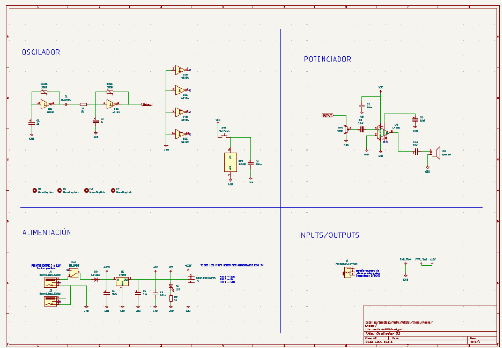
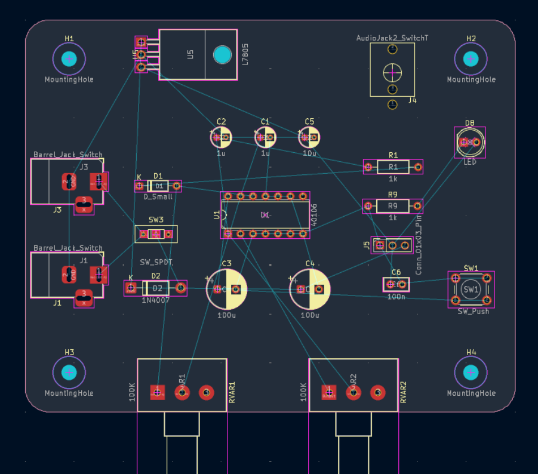
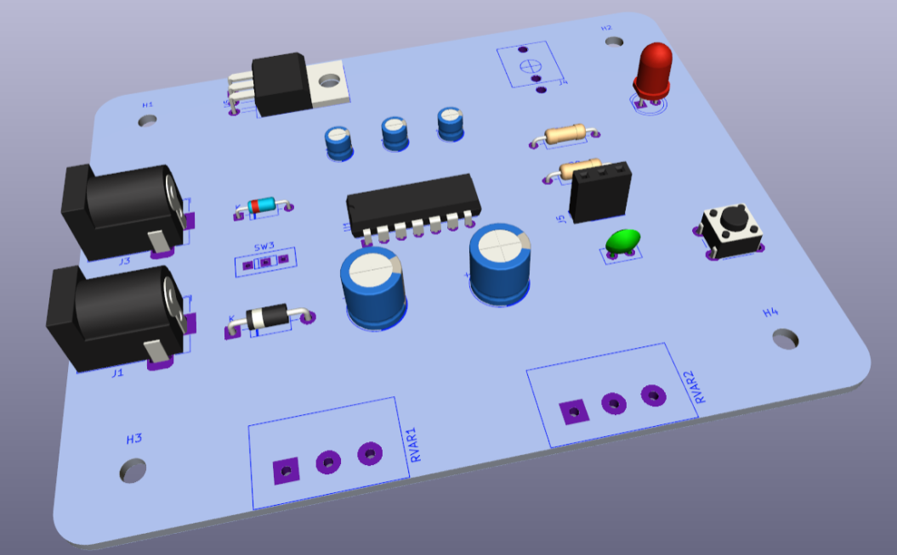
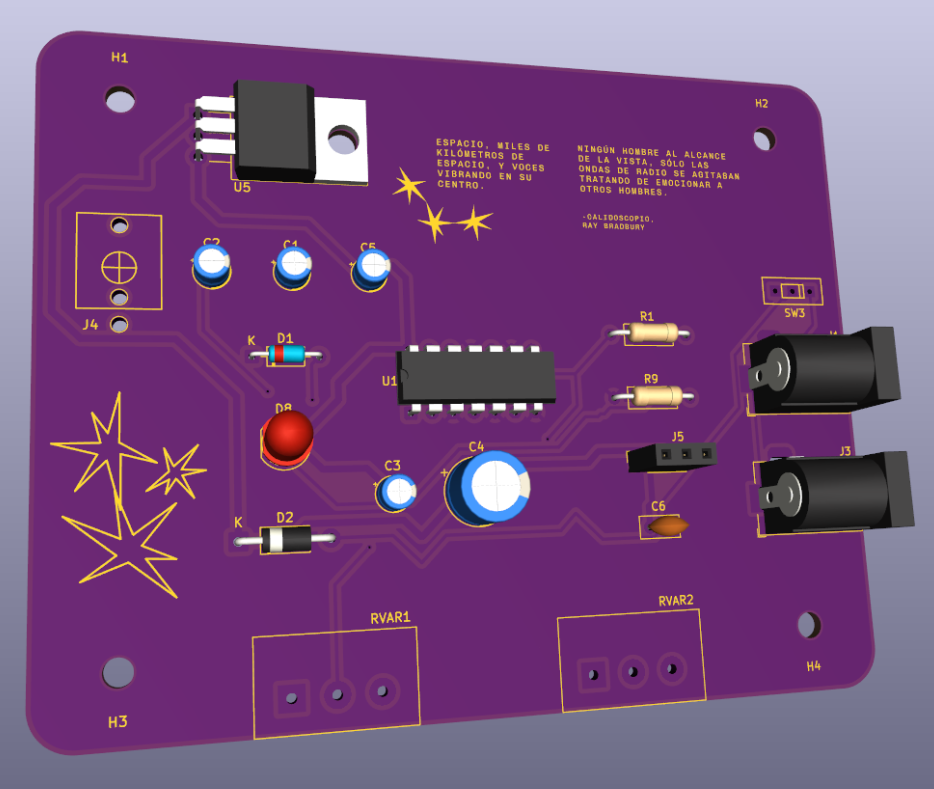

# sesion-12a

martes 2 de junio

## parte final proyecto 02

- ajustar esquemáticos con los condensadores que se modificaron
- definir nombre a cada oscilador y por qué
- armar PCB de ambas propuestas

estoy haciendo los archivos de la propuesta 2, y me falta armar la pcb

### esquemático propuesta 02

### organización componentes

### avance en pcb

### versión final pcb

hice modificaciones en la organización de los componentes para poder incluir las gráficas y los textos!

