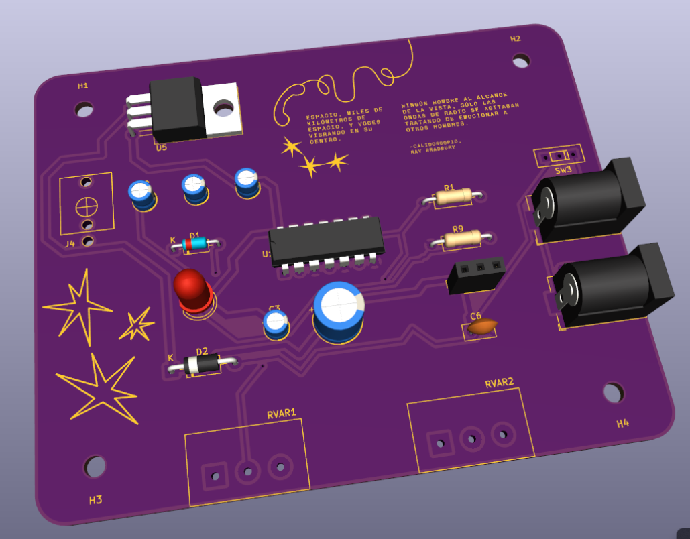
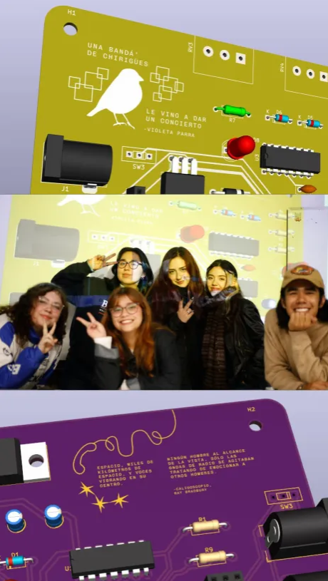

# sesion-12b

viernes 5 de junio

## presentación proyecto 02

hablaré sobre la propuesta 2 ya que hice el esquemático y la placa, está dividido en módulos, primero el oscilador en si con el chip 40106, al lado está el amplificador que utilizamos para poder probar el sonido, y abajo la alimentación y los estándares que nos dieron

la placa tiene esos colores (base morada con textos en amarillo) ya que conecta super bien con nuestra idea de comunicaciones espaciales, por el sonido que genera el oscilador, y mezclar toda esta onda del espacio, universo, las estrellas

### post presentación

arreglamos la gráfica que no llegó a salir en la pcb que mostramos (el teléfono) que igual era súper importante porque el oscilador literalmente en cierto punto sonaba como uno, así que lo agregamos y lo volvimos a subir para que la placa que manden a hacer si lo tenga!

### diseño final final de la pcb de la propuesta 02

### fotito grupal y placasss

