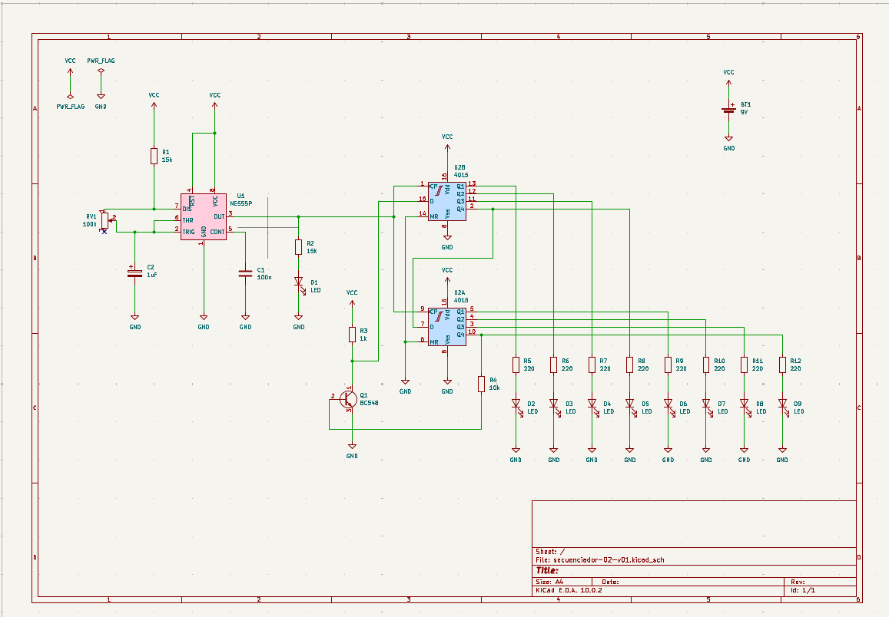

# sesion-11b

Clase del 29 de mayo

|paso|proceso|
|----|-------|
| 1 | Empezamos armar el circuito del cd 4015 en la protoboard, para empezar hacer las pruebas en fisico |
| 2 | Se empezo a haver la v2 del circuito cd4040, con las mejoras, con las conexciones para el cd4015 |
| 3 | 1er intento, no resulto, nos olivamos de conectar las placas entre si | 
| 4 | 2do intento prendio, se prendio hasta el 4 led pero no oscila ni se reinicia, falto conectar el reset, el pin 1 iba conectado al pin 9 pero estaba mal conectado | 
| 5 | Sospechas se cambiaron los leds del paso 5 y paso 6 |
| 6 |  fallas cambiamos leds quemados malas conexiones de leds resitencias que no tocaban la plaquita |
| 7 | se cambio la resistencia del 555 de 1k a 15k y logramos hacer el circuito mas estable |
| 8 | Al cambiar las resistencia dio mas tiempo al chip mas margen temporal al tiempo, un clock mas lento hace el circuito mas estable |

## **Registro en clases**

Nuestro 1er intento

## **Kicad**

Revisar doc de los estandares

estandar: imputs/outputs-audiojack2_switcht 

Fuentes: barrel_jack_switch

## **Modificacion/correcion:**

unificar ondas 
estamos viendo la opcion de reduciorlo de 8 pasos a 4 pasos

## **Organizacion grupal**

Por hacer:

- subir secuenciador 01 v2 (4040)/ tomas
- subir secuenciador 02- v02 (version missa) (falta hacer pcb)/ listo
- esquematico con transistores para ambos circuitos / Cami 
- 4093 armado / daya
- 386 armado / Isi
- actualizar documentacion / Angel
