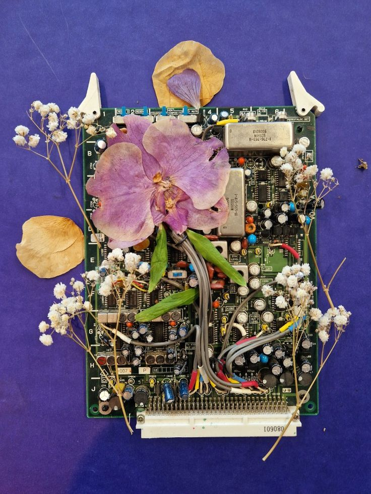
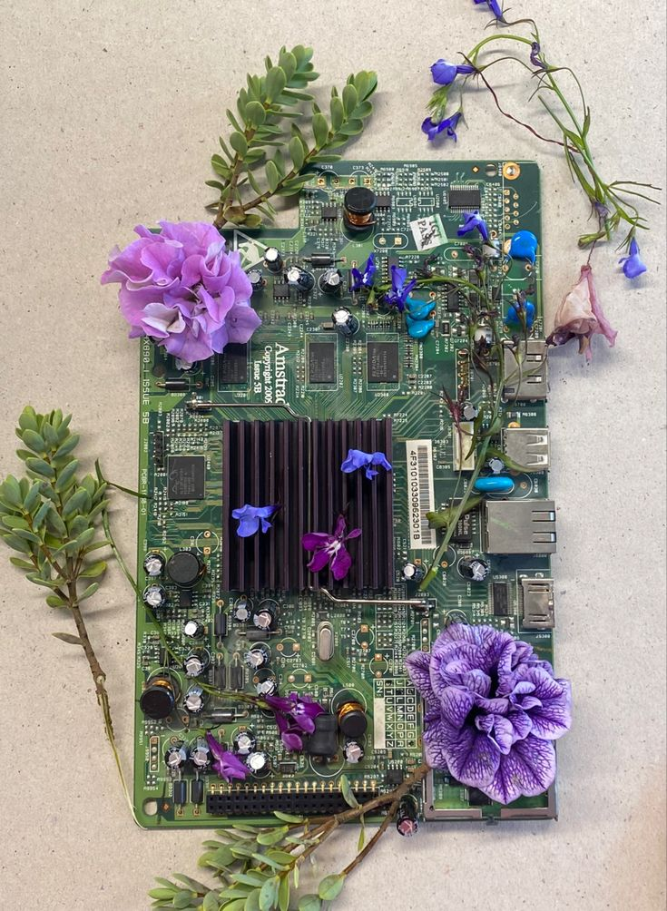

# sesion-13a

Clase del 9 de mayo

Este martes falte por que me resfrie y me sentia muy mal, mis compañeras de grupo me puso al corriente me comento lo que hicieron, me dijo que vieron como enviar los archivos de kicad a JLCPCB.
Tengo que investigar mas sobre eso para poder entenderlo bien, las placas ya se habian mandado a china, quedo 15 placas pcb para cada grupo a nosotras se nos mando hacer 30 placas porque mandaron los 2 circuitos

KiCAD A JLCPCB:

Tambien me menciono sobre lo que tendremos que hacer como grupo para el proyecto 03, tenemos que empezar a ver ideas para nuestra carcasa del sintetizador, me comento las ideas que tiene para la carcasa, para el proyecto 03 tenemos que realizar un sintetizador en base a los módulos genereados por el curso.
Esto debe venir acompañado de una carcasa. nosotros veremos si lo hacemos modular o todo en una caja, ellas me comentaron que se imaginan algo muy industrial para hacer la carcasa empezamos hablar de la opcion de hacerlo en acero carcono o algun otro tipo de metal.

## **PROPUESTAS/IDEAS:**

Nos gustaria mezclar lo que es plantas o flores con metal

## **TEXTO YOKO ONO**

