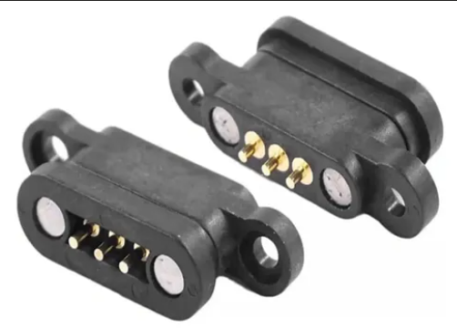

# sesion-13b

Clase 12 de junio 

*teloneo misaa*

*Partituras:* 
musica de pendulum: es un manual/instrucción

REVISAR ???

## **TRAER EL PROXIMO VIERNES**

-lista materiales que usaremos
  -ensamblaje de 3 pcbs de las quuehayan participado en su diseño
    -propuesta de dos partituras para perfomance de 5min con el sitentizador diseñado

## **TRABAJO GRUPAL**

- Conectores magneticos Pogo
  
ver posibilidad de no usar cables y usar estos imanes que haras de conexión de placas

- Si usamos metal deberiamos hacer un modulo grande y no distintos modulos or costos y facilidad de uso
  
- Sensor de movimiento
  
- Ver que circuito haremos de los demas grupos

- tendremos que hacer que nuestro secuenciador prenda y apaguen luces basicamente, porque otros grupos no pusieron imput, seria algo divertido de averiguar 
  
# **Propuestas de materiales:**

- cemento/yeso
  - metal
    - acrilico
      - impresion 3d

# **TENER OJO**

- Ver posibilidad de hacer secciones de trasparencias
  - Ver como convive la humedad con la soldadura y los componentes

-tenemos para usar:
 - 2 Secuenciador si o si
  - Piezo
   - 1 filtro
     - reloj
       - Percusión 1 
  
## **Acuerdos como grupo**

- 1 solo modulo
- **Elowan a plant-robot hybrid**
    - https://www.media.mit.edu/projects/elowan-a-plant-robot-hybrid/overview/
- Para inspiraciones
  - https://loliel.narod.ru/DIY.pdf
- llegar con los dos secuenciadores y el piezo soldado para el viernes 19
- 

