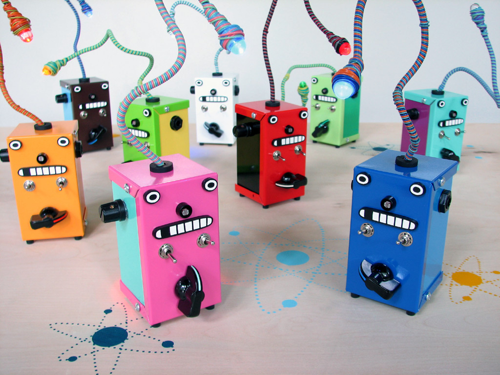

# sesion-13a

Martes 09 de Junio, 2026. 

Nota del día: A pesar de que no llegué tan temprano como otros días no había nadie en la sala (lo que es algo raro).

## Referentes (y otras cosas)

- **Camilo Cantor** es un artista sonoro, diseñador interactivo y gestor cultural colombiano, ampliamente reconocido por haber liderado el Exploratorio del Parque Explora en Medellín. En su conversatorio junto a Missa titulado *"Una idea llamada hechizo"*, comparte reflexiones en torno a la creación colectiva, la tecnología comunitaria y los procesos de experimentación artística y pedagógica en Latinoamérica. - <https://www.instagram.com/camikant/>
- **Hechizo "por mientras para siempre"** es una publicación/libro que recopila memorias, metodologías y aprendizajes desarrollados en el Exploratorio de Medellín. El texto aborda cómo los espacios de creación y los talleres abiertos funcionan bajo la premisa de la experimentación constante, donde los "hechizos" (soluciones ingeniosas o prototipos rápidos) se vuelven soluciones duraderas en las comunidades.
- **Cantó el gallo y no supo dónde** (libro). 
- **Gambiologia** es un libro y proyecto conceptual brasileño (impulsado por Fred Paulino) que eleva la "gambiarra" (el arte de la improvisación, el remiendo y la reparación informal típica de Brasil) al estatus de práctica artística y tecnológica. El libro analiza cómo el ingenio popular utiliza la basura electrónica para hackear y reconfigurar la tecnología comercial frente a la escasez.
- **Exploratorio de Medellín** es el taller público de experimentación del Parque Explora. Funciona como un "pañol abierto a todo público" o un *makerspace* ciudadano, un laboratorio ciudadano donde cualquier persona puede acceder a herramientas, tecnologías, conocimientos de fabricación digital, electrónica, artes vivas y ciencia para desarrollar proyectos comunitarios de manera colaborativa. - <https://www.instagram.com/exploratoriomde/>
- **Parque Explora** (Colombia) es un impresionante centro de ciencia y tecnología ubicado en Medellín, referente en Latinoamérica por su enfoque interactivo, social y educativo ("similar al MIM pero mas bacan", está expandido con un acuario, un planetario y espacios abiertos como el Exploratorio). Está diseñado para democratizar el conocimiento a través del juego, la experimentación física y el diálogo comunitario. - <https://www.instagram.com/parqueexplora/>
- **@nrmbnt** (Norma Benito) es una diseñadora, artista y tejedora chilena enfocada en la intersección entre el diseño textil, los oficios tradicionales y la manufactura local. Desarrolla proyectos que vinculan el tejido, la materialidad y la memoria visual en entornos de diseño independiente. - <https://www.instagram.com/nrmbnt/>
- **@no.si.si.no** (María Ignacia Valdebenito) es una diseñadora, investigadora y educadora chilena cuya práctica se centra en el diseño editorial, la experimentación gráfica y la educación artística. Ha participado en diálogos y proyectos en torno a la publicación independiente y la pedagogía crítica en el diseño. - <https://www.instagram.com/no.si.si.no/>
- **Mariairis Flores Leiva** es una destacada curadora de arte, investigadora y teórica de la historia del arte chilena. Su trabajo se enfoca en las prácticas artísticas contemporáneas, el feminismo, las editoriales independientes y la gestión cultural en Chile, colaborando activamente con galerías, museos y publicaciones críticas independientes. - <https://www.instagram.com/mariairis_flores/>
- **Mónica Bate** es una artista visual, investigadora y académica chilena de la Universidad de Chile. Su obra explora la relación entre sonido, materia, tiempo y tecnología, utilizando la electrónica analógica, la computación física y el diseño de sistemas interactivos para crear instalaciones sonoras y esculturas cinéticas de alta complejidad conceptual.
- **Ernesto Oroza** es un diseñador, artista e investigador cubano, pionero en el estudio del diseño vernáculo y las prácticas de subsistencia en épocas de crisis económica en Cuba (especialmente durante el "Periodo Especial"). Su trabajo documenta cómo los ciudadanos reinventan objetos cotidianos mediante el reciclaje y la adaptación técnica extrema.
- **Desobediencia tecnológica** es un libro y concepto fundamental acuñado por Ernesto Oroza. El texto analiza y teoriza las prácticas de los ciudadanos cubanos que modifican, reparan y combinan electrodomésticos y tecnologías obsoletas occidentales, rompiendo la lógica del consumo, la obsolescencia programada y las imposiciones industriales de las grandes marcas a través del hackeo popular.

Referentes carcasa: (sintetizadores "divertidos")

- Bleep Labs

## Qué pasó hoy 

### Conversatorio 

"“Una idea llamada hechizo: los múltiples saber-cómo en latinoamérica”"

- *Parrillas improvisadas a partir de barriles para alimentar ollas comunes, carros de supermercado adaptados como locales de comida, neumáticos que adquieren nuevas vidas como cercos o columpios después de jubilarse[1]. Soluciones temporales, que terminan sostenidas ad infinitum. O ante la necesidad, la contingencia. En Chile, el concepto de lo “hechizo” es un indicio de una relación casi mágica que ocurre con la técnica, cuando la necesidad/inventiva/chispeza induce a la realización práctica de un saber aprendido a través de relaciones directas con la materia, vínculos de disciplinazgo o desde la directa necesidad específica que requiere una resolución apropiada.*

**Hechizo** - "Gambiarra" en Brasil  - "Cacharreo" en Colombia. 

- Hechizo: saber solucionar cosas con otras cosas de manera creativa.
- según gemini: arte universal de solucionar un problema con lo que hay a mano, de forma improvisada, creativa y, a veces, un poco descabellada. Es el "ingenio popular" en su máxima expresión. Cada cultura tiene su propia palabra para definir este "canibalismo" de objetos y soluciones temporales (que muchas veces se vuelven permanentes).

#### Ernesto oroza

mayor exponente del "hechizo" - "Desobediencia tecnológica" (libro)

La relación con los materiales que te permite no depender del consumismo.

Ernesto es de cuba, nació todo en base a que como es un país pobre y que no tiene mucho acceso a cosas "nuevas" tienen que ingeniárselas para reparar cosas necesarias para el día a dia. 

Según gemini, Ernesto Oroza es un diseñador e investigador cubano que teorizó el "hechizo" y el "cacharreo" bajo el concepto de Desobediencia Tecnológica. A través de su trabajo, Oroza documentó cómo los cubanos, ante la escasez del Período Especial, desafiaron la lógica industrial y la obsolescencia programada, abriendo, reparando y canibalizando electrodomésticos para crear soluciones vitales (como el famoso rikimbili). Para él, estos inventos no son simples parches precarios, sino una forma de resistencia cultural y un modelo de diseño sostenible donde la vida útil de un objeto no termina cuando se rompe, sino que es ahí donde realmente comienza su potencial.

### "hablemos de placas"

- Mandaron a hacer las placas presentadas en el proyecto 02!! a China, los profes esperan que lleguen la proxima semana. 
- a partir de ahora para armar o ver las placas hay que hacerlo desde la versión de los profes !! subida a la carpeta **00-produccion-pcbs**.
  
Para exportar la placa PCB en formato Gerber, se debe presionar el botón de Plot ubicado arriba a la izquierda y, en la ventana emergente, seleccionar las capas necesarias, que como mínimo son 7: las 2 de cobre, 2 de silkscreen, 2 de máscara y el contorno. Tras guardar todo en una carpeta, se deben realizar dos clics clave, uno en Plot y otro en Generar archivos de taladrado. Como este proceso arroja una gran cantidad de archivos, lo ideal es pasarlos por el visor Gerber para revisar que todo tenga sentido y comprobar meticulosamente que la silkscreen no tape los nombres de los componentes. Si todo está en orden, se comprime la carpeta y queda lista. Luego, se ingresa a la página de JLCPCB y se sube el archivo Gerber; en la ventana de cotización, además de aparecer el precio, el sistema realiza un primer chequeo para confirmar que el archivo esté bien estructurado. Al presionar Gerber View, se pueden inspeccionar las capas, ver la placa en 3D y confirmar que las medidas estén perfectas. Finalmente, si todo se ve bien, se selecciona la cantidad, el color de la placa y el tipo de acabado; aunque el estándar es HASL con plomo, se recomienda elegir la opción sin plomo para cuidar la salud de los operarios.

### Conceptos

- **Crowdsourcing**: Colaboración abierta y distribuida donde una comunidad aporta ideas o trabajo para resolver problemas.
- **"La fuente de las cosas en general"**: El origen común y la base de recursos compartidos de los que dispone la humanidad para crear.
- **P2p**: Red entre pares; modelo social y digital de intercambio directo entre personas sin intermediarios centrales.
- **Couchsurfing**: Práctica global de hospitalidad gratuita basada en el intercambio cultural y la confianza mutua.
- **Commons**: Bienes comunes compartidos y gestionados de forma sostenible por una comunidad fuera del mercado.
- **Crowdfunding**: Financiación colectiva en línea a través de pequeñas aportaciones de muchas personas.
- **Maker**: Cultura centrada en la fabricación colaborativa y el "aprender haciendo" mediante tecnología o artesanía.
- **Innovation**: Proceso de modificar elementos existentes para introducir novedades y optimizar soluciones.
- **Coworking**: Espacio de trabajo compartido por profesionales independientes para colaborar y reducir costos.
- **Networking**: Construcción y gestión de una red de contactos para generar oportunidades profesionales.
- **Kickstarter**: Plataforma global de financiación colectiva basada en recompensas para proyectos creativos.
- **Tequio**: Tradición mexicana de trabajo comunitario obligatorio y gratuito para el mantenimiento del pueblo.
- **Minka**: Tradición andina de trabajo solidario para obras de utilidad comunal con retribución social.
- **Gambiarra**: Término brasileño para una solución improvisada, rápida y creativa con los recursos disponibles.
- **Mutirao**: Movilización colectiva brasileña de ayuda mutua vecinal para realizar una tarea pesada gratuita.
- **Trueque**: Intercambio directo de bienes o servicios sin el uso de dinero.
- **Corima**: Práctica de reciprocidad rarámuri de compartir bienes con quien lo necesita como deber social.
- **Sumak kawsay**: Filosofía andina del "Buen Vivir" en armonía con uno mismo, la comunidad y la naturaleza.
- **Diy**: "Hazlo tú mismo"; filosofía de fabricación, reparación y autosuficiencia sin depender de expertos.
- **Procomun**: Modelo de gestión comunitaria que protege y mantiene los bienes comunes libres de privatización.
- **Rinkimbili**: Bicicleta cubana modificada artesanalmente con un motor para el transporte de supervivencia.
- **Minga**: Trabajo comunitario voluntario en Sudamérica para una obra colectiva que culmina en una celebración.

## Sobre proyecto 03

última nota de los profes del semestre.

3 puntos grupales:

- Lista de materiales (bom), incluyendo cantidades, placa, presupuesto, stock.
- Ensamblaje de 3 PCBs de las que hayan participado en su diseño.
- Propuesta de 2 partituras para performance de 5 minutos con el sintetizador diseñado. (¿difícil? panico!!! - ¿Hacer partituras? Wtf) 

3 puntos individuales:

- Bitácora de trabajo de junio.
- Bitácora de lectura de libro junio.
- Presentación oral.

Referentes profes: 

- Partituras experimentales: <https://llllllll.co/t/experimental-music-notation-resources/149/55>
- Más partituras experimentales: <https://www.theguardian.com/music/gallery/2013/oct/04/graphic-music-scores-in-pictures>
- Partituras de escucha de Pauline Oliveros: <https://www.are.na/block/5993597>

Ideas de carcasas:

(Si bien en esta entrega no nos piden carcasa (porque eso es para el examen), estuve planteando/pensando algunas ideas que podiamos utilzar en base al referente que nos mostraron en clase)

Más que nada me gustaría que no fuera para nada convencional, algo muy divertido (como las placas). 

- Un panel de abejas para la placa de abejas.
- Un monstruito o algo que requiera de un corazón para vivir en el caso de la placa de corazón.
- Si el panel de abejas no funciona puede ser algo como una flor o algo relacionado directamente con las abejas y que pueda tener sentido también con los potenciómetros que si o si van a sobresalir.
- Caja simple con cuatro potenciómetros que son flores grandes, las flores son las que se giran.
- Flores que la parte del polen (amarillo estereotipicamente) se mueve.

## Encargo-13a 

Leer capítulo 1 y 2 del libro Pomelo de Yoko Ono, compartir apuntes y reflexiones críticas sobre el texto, prohibido usar inteligencia artificial, no sirve para este ejercicio.

