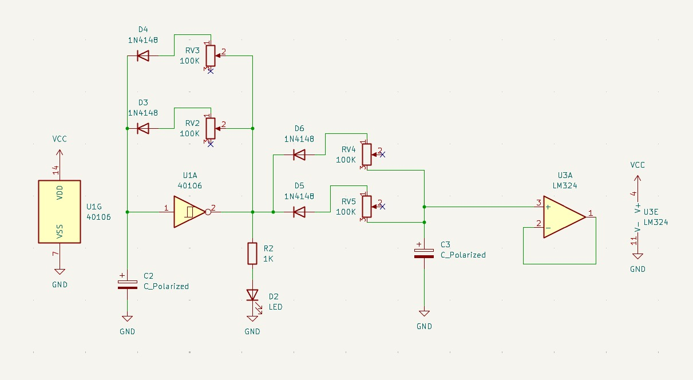
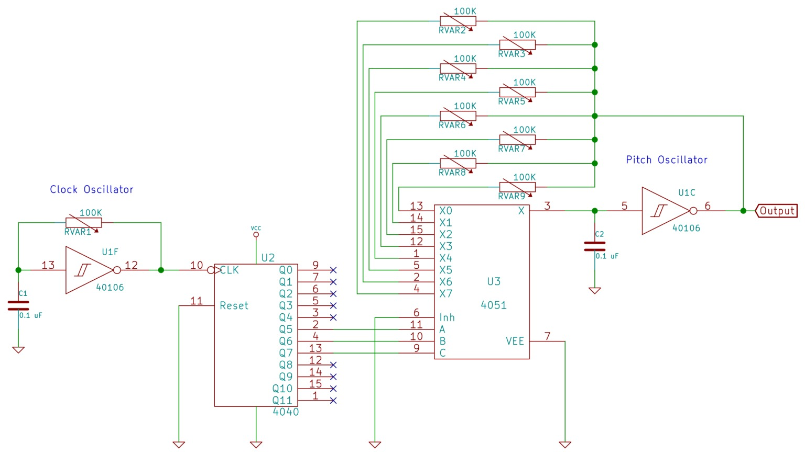

# sesion-11a
26 de mayo del 2026

¡Hola profe Aaron, Misa y Emi!, espero que se encuentren muy bien.   
El día de hoy continuamos trabajamos en el proyecto de la solemne 2, y definimos nuestras dos propuestas, y a la par, sus esquemáticos.   
Veamos:

Propuesta 01:
Como mencione la clase pasada, para esta propuesta, usamos 2 chips; el CD40106 y el LM 324, con los cuales obtendremos dos tipos de onda; cuadrada y de sierra.

Propuesta 02:

