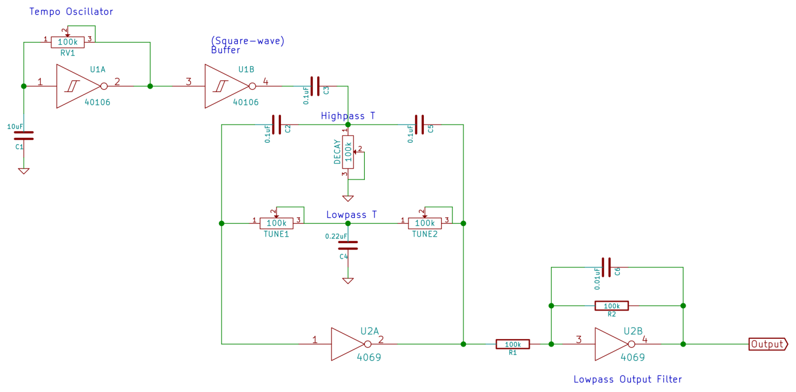

# sesion-10b
## 22 de mayo del 2026

### Desarrollo en clases

## Primer circuito percutor

### Logic noise drumb and filter percutor circuit - Elliot Williams

[Logic Noise: Filters And Drums](https://hackaday.com/2015/03/25/logic-noise-filters-and-drums/)

