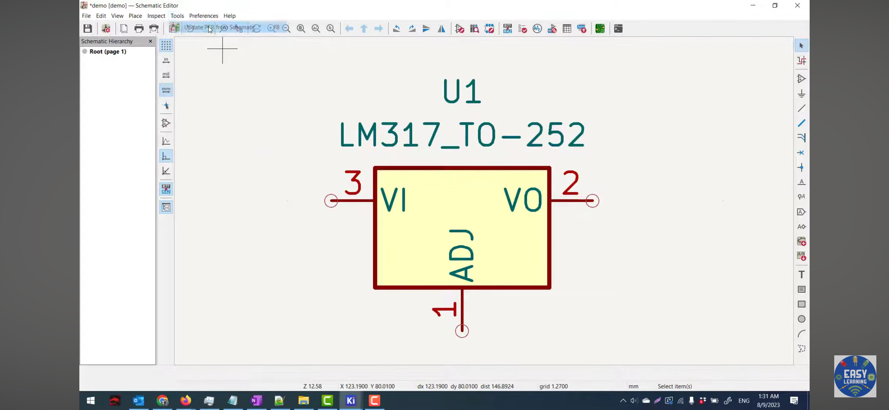
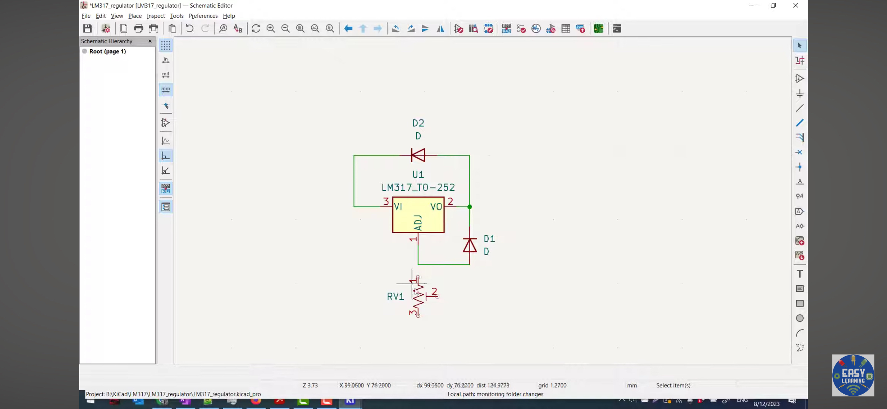
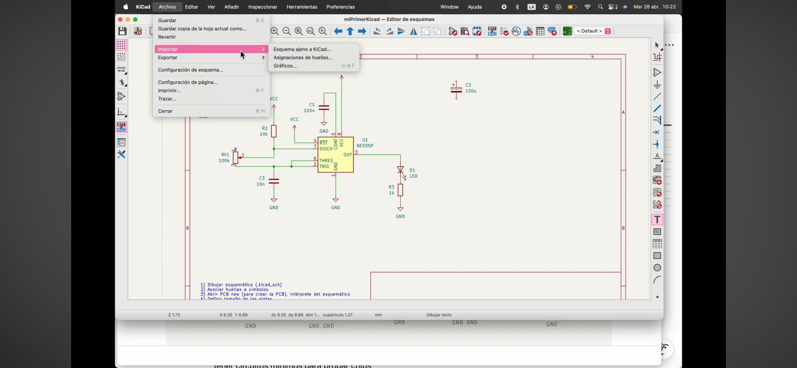

# sesion-08a

No fui :( me sentía muy mal. 

Pero mi amiga Narely me compartió sus apuntes y lo visto en clases <3
___
## ¿Qué hicieron?

**KiCad**

+ Instalarlo desde Google, GitHub, Norteamérica.

1. Dibujar esquemático KiCad (.kicad_sch) 

2. Asociar huellas a símbolos 

3. Abrir PCB New (para crear PCB), intérprete del esquemático 

4. Definir tamaño de las pistas 

5. Repartir componentes físicamente 

6. Rutear componentes 

7. Ornamentar y exportar fabricación

Quizás hay que hacer nuestras propias huellas.

Archivo → Nuevo proyecto → Default KiCad 

+ GND 
+ VCC 
+ R 
+ C 
+ C - polarized 
+ R - pot 
+ LED 
+ battery_cell 
+ speaker 
+ 555

+  A = abrir menú 

+ M = mover 

+ CTRL + D = duplicar 

+ R = rotar 

+ V = cambiar valor 

+ T = texto 

+ E / doble click = propiedades 

+ Cambiar huella (biblioteca) 

+ CTRL + S = guardar 

Vitronics.cl = ver medidas de los componentes 
___
Revisé por mi cuenta ese día videos tutoriales. 

Y luego, cuando Misa subió el video de la clase, lo vi para ponerme al día :) 

Aún no entiendo muy bien, debo practicar y seguir revisando los videos. 
