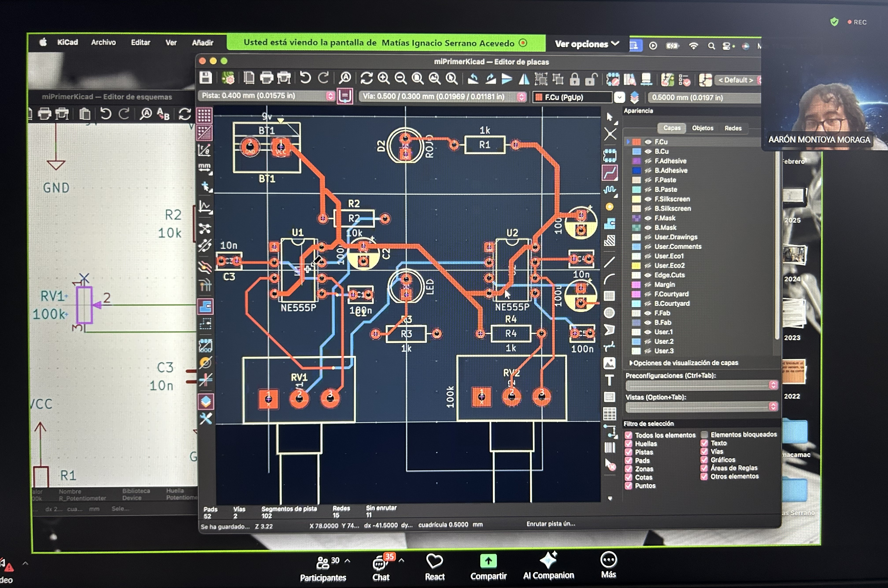
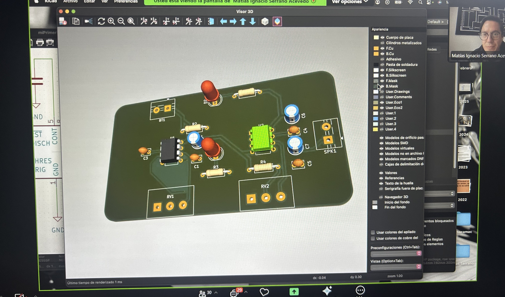
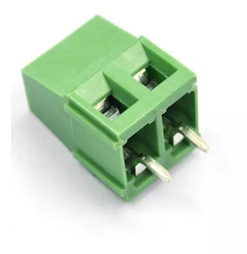

# sesion-10a

Clase online 

Fome, fome. La construcción frente a mi departamento no me dejaba escuchar bien :(
___
Eduardo Bonvallet 

“Hay que creerse el cuento”. 
___
## Para abrir documento 

+ Nuevo proyecto 
+ Pide dónde guardar 
+ Abrir el Sch 
+ Esquemático

## Repaso KiCad 

### Paso 1: Dibujar esquemáticos 

+ A: agregar símbolo+ 
+ R: rotar 
+ Si aprieto A → VCC / GND 
+ G: para mover sin arrastrar todo (para acomodar) 
+ V: editar campo de valor 
+ ESC: para volver 
+ M: mover 
+ CMD + S / CTRL + S = guardar 
+ Indicar si un componente no tiene conexión (N)

Ojo: si no hay punto, no hay conexión. 

### Paso 2: Asociar huellas a símbolos 

+ ASIGNAR huellas a símbolos (la huella es el espacio que ocupa en la base del componente). 
+ Click y E: propiedades del componente (editar) 
+ F: revisar huellas asignadas 
+ CTRL + D: duplicado exacto 
+ R: rotar 
+ X: reflejar en el eje X 
+ Y: reflejar en el eje Y 

### Paso 3: Abrir PCB New 

+ Pasar las asignaciones (Actualizar placa es el botón verde). 
+ Alt + 3: visor 3D (para ir viendo cómo quedan las cosas).

### Paso 4: Definir contornos

+ Para dibujar contornos debe estar seleccionada la capa Edge Cuts (solo para el contorno de la placa). 
+ La placa debe tener un lugar físico y eso se hace con el contorno. 
+ Arcos en las esquinas de la placa (5 mm) con herramienta rectángulo. 
+ E: redondear el rectángulo. 

### Paso 5: Repartir componentes físicamente

+ Pistas (importante). 
+ Es como la protoboard y los cables. 
+ Pinceles. 
+ Los cables. 

Dato: doble pantalla. A un lado el esquemático y al otro la placa. Si selecciono algo en la placa, me indica en el esquemático cuál es. 

+ Marcar centros de la placa y agregar márgenes. 

En CTRL + M, si mantengo presionado CTRL, no sigue la grilla. 

### Paso 6: Rutear componentes 

+ Capa de ruteo (que las cosas se conecten entre ellas). 
+ X: enrutar pista única 
+ No existe el “saltito”, pero se puede ir cambiando de capa. 
+ V: pasar de capa inferior a superior y viceversa. 

Vía = una dona 
+ Permiten conectar ambos lados de la placa con la misma ruta.

### Paso 7: Ornamentar y exportar fabricación

+ Nombre de red: GND 
+ Encerrar la placa 
+ Comprobar reglas de diseño para errores 

+ MountingHole (M3) 
+ Agujeros (Se les deben agregar huellas).

Dato: no son dibujos; son vectores, píxeles, gráficos (en DXF o SVG). 

+ Archivo → Importar → Gráficos  
+ Capa de serigrafía

Bloque de terminales o conector de tornillo, de tipo modular, con soporte de hasta 16 A con 300 Volts AC. Posee un tamaño mediano, además de una separación entre pines de 5 mm (0.2 pulgadas).Es compatible con protoboard.

