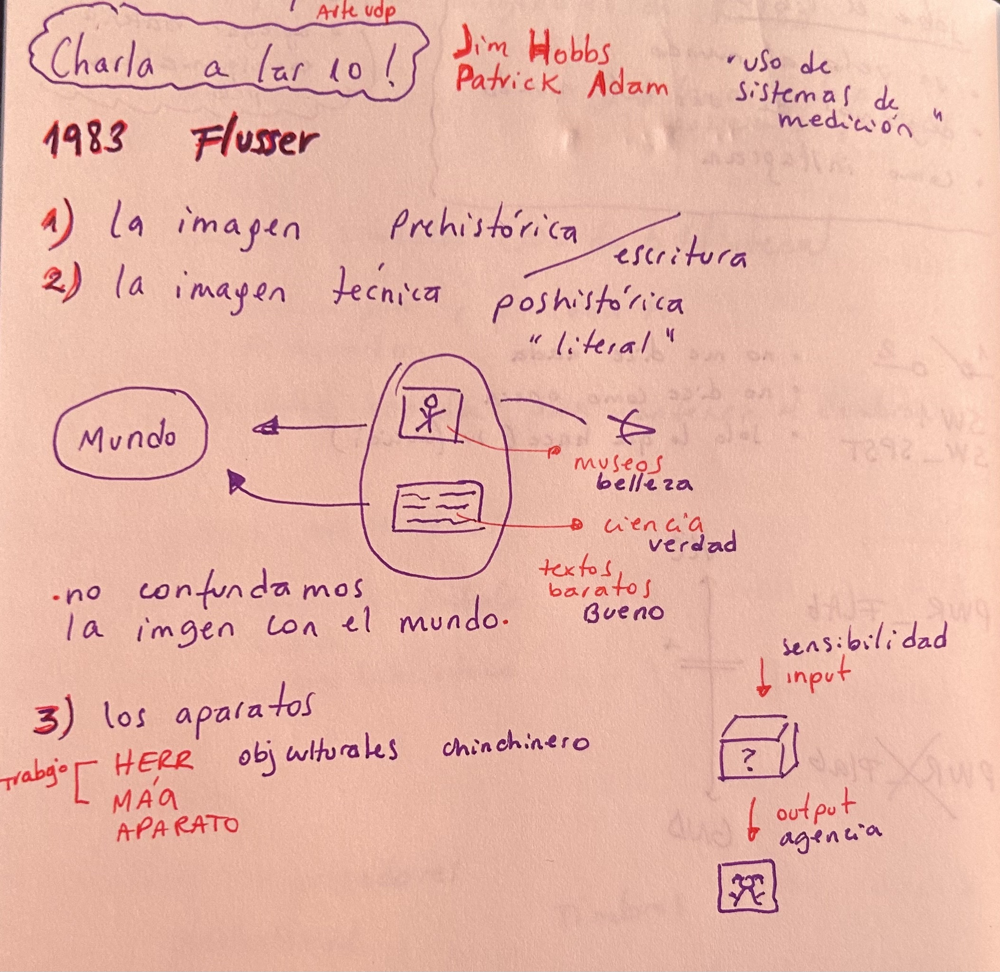
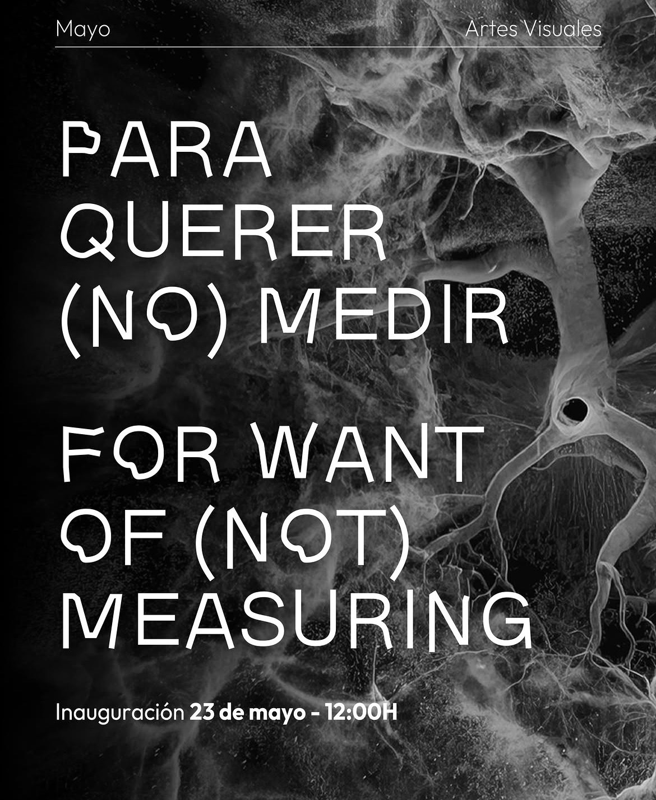
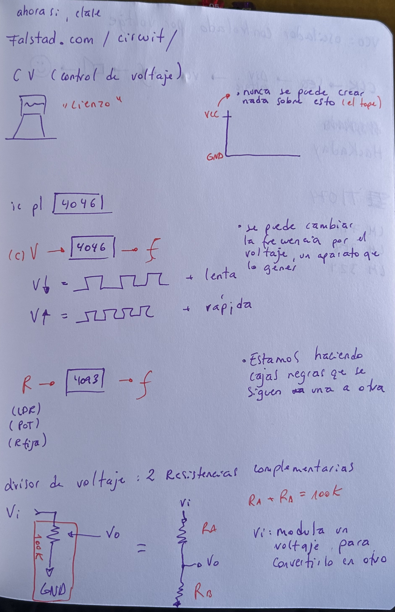
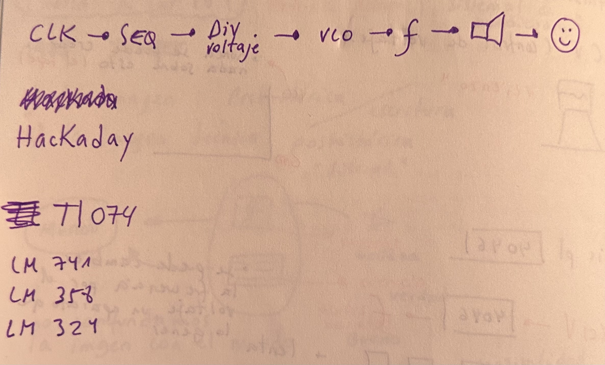
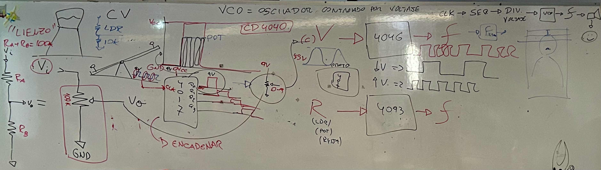
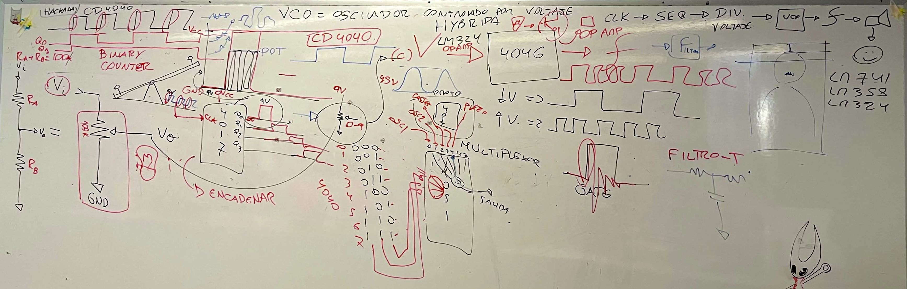

# sesion-11a

Comentarios sobre los capitulos 1, 2 y 3 de Hacia una filosofía de la fotografia (1993), de Vilém Flusser. 

"No confundamos la imagen con el mundo", me faltó la a en la croquera, ups.

___

## Charla “For Want of (Not) Measuring”

"Para querer no medir"

### Patrick 

+ El proyecto comenzó en 2022, buscando encontrar la intersección entre el trabajo de Patrick Adam y Jim Hobbs.
+ El concepto de la exposición trata sobre cómo usamos la medición y cómo, a veces, en la vida decidimos no medir.
+ Patrick tiene una galería en Inglaterra llamada “Proyecto 78”.
+ Recibieron una invitación en Londres, de la galería Proyecto King, para presentar su exposición.
+ Patrick está interesado en cómo usamos los sistemas de medición en el mundo.
+ También reflexiona sobre cómo aceptamos estos sistemas sin pensar realmente qué significan.
+ Dato: hace 300 años intentaron calcular el peso del mundo escalando una montaña en Escocia con péndulos y telescopios; lograron calcular aproximadamente un 20% del peso del mundo.
+ Patrick escala montañas utilizando elementos de medición, siempre la misma montaña.

### Sistema inestable

+ Le interesan esos sistemas que parecen estables, pero que, al observarlos detenidamente, resultan ser inestables.
+ El padre de Jim trabajaba en General Electric y estaba a cargo de probar ampolletas; en el suelo había una grilla con ellas.
+ De ahí surge la idea de la grilla o cuadrícula de 16 mm.
+ La cuadrícula se tomó como una referencia simbólica que permite que ingresen muchas cosas, pero al mismo tiempo no es un espacio seguro; existe inestabilidad en esa idea estructural.
+ El proyecto sobre la medición establece un diálogo con otros artistas en cada lugar donde se presenta.
+ Han estado en distintos lugares y ya han realizado siete exposiciones. En algunas incluyen performances, dependiendo de la relación y de los intereses de los curadores con quienes trabajan.
+ Cada exposición es una nueva versión del proyecto: establecen una relación con el contexto donde se instalan y con los artistas, además de generar nuevas publicaciones.
+ Jim mandó a hacer una especie de vinilos con una mica que produce sonido, como una canción.
+ Para cada exposición crean nuevas publicaciones y ediciones limitadas. 

### Simon 

+ Presenta un escáner que tiene un espejo en su interior que gira constantemente en horizontal y vertical. Tiene un láser que choca con el mundo y devuelve la señal al escáner; se utiliza para medir el mundo.
+ Mostraron una imagen de un edificio escaneado por el dispositivo. Se pueden crear modelos digitales, como el del edificio, que tiene 8 millones de puntos.
+ Cada punto corresponde a un evento del láser con el mundo, formando una “nube de puntos”.
+ La nube no tiene límites: la misma máquina busca puntos constantemente. No le interesa tanto el acto de medir, sino el concepto de nube.
+ Ejemplo del árbol: es visto como un conjunto de fuerzas y como una red, no como un sólido. Es flexible y se va adaptando.
+ Hablaron de un árbol de 355 años que tiene frecuencias y ondas.
+ Para nosotros el árbol es muy lento; para el árbol, nosotros somos muy rápidos, y para la montaña el árbol también es muy rápido.
+ Los modelos digitales pueden intervenirse con sonido.
+ **Polycam - app.**
+ No es que el láser atraviese el muro; da una sensación de interior, pero no lo muestra realmente: son los puntos de la nube.

___

## Apuntes clase 

**Y como dijo el gran Misa: "Si no puedes contra ellos, confúndelos" (2026).**

VCC: es el tope; nunca se puede crear nada por sobre esto.

Se puede cambiar la frecuencia por voltaje con un aparato que lo genere. 
+ Menor voltaje → la frecuencia es más lenta.
+ Mayor voltaje → la frecuencia es más rápida.

Estamos haciendo cajas negras que se siguen una a la otra. 

Divisor de voltaje: dos resistencias complementarias.
+ Ra + Rb = 100k
+ Vi: modula un voltaje para convertirlo en otro.

VCO: oscilador controlado por voltaje. 

Revisar Hackaday para nuestro proyecto. 

 

