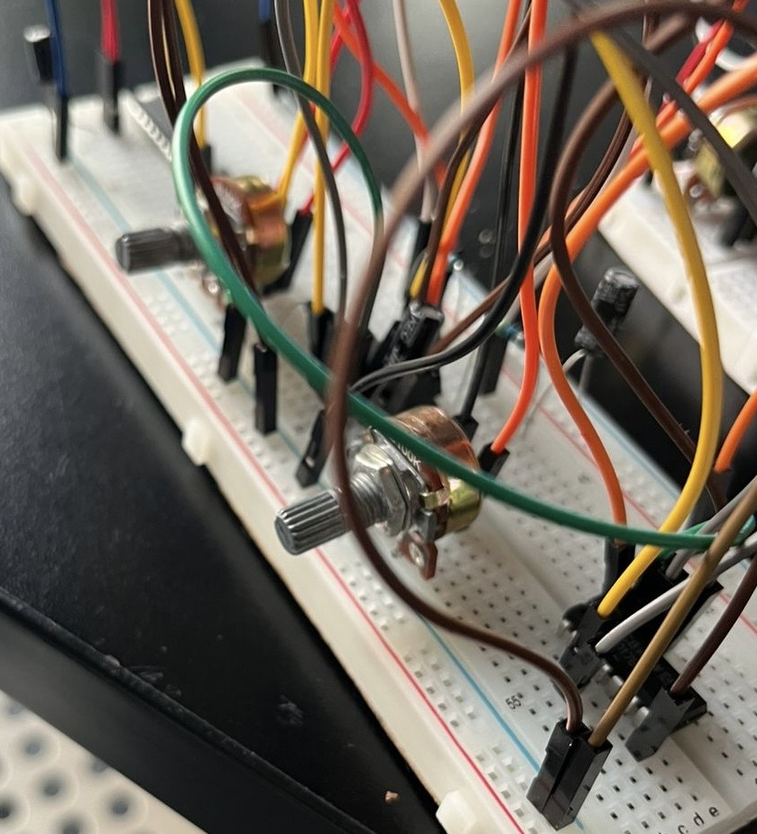
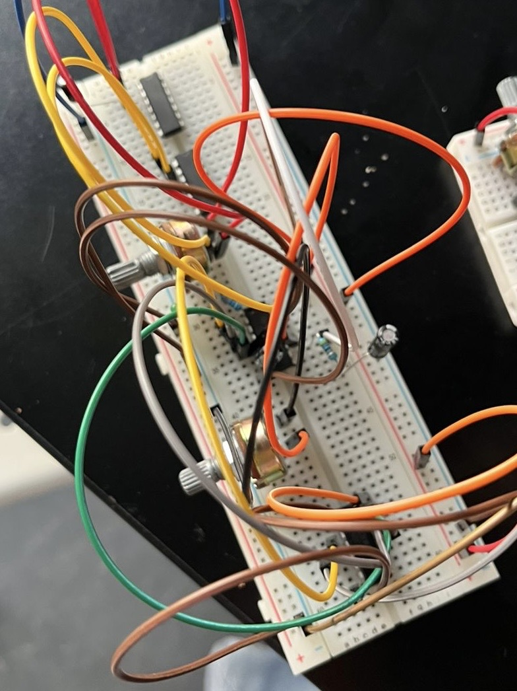
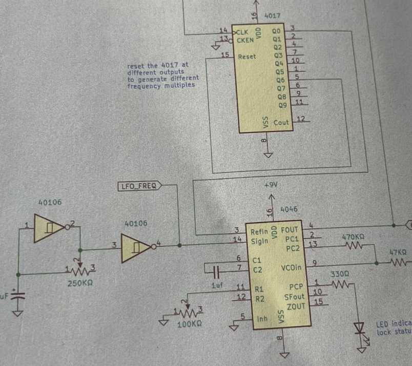

# sesion-11b

## Comentarios capítulos 

Capítulo 4: Cómo salir del programa. 

Capítulo 5: Maniqueísmo: lucha entre el bien luminoso y el mal oscuro. 

| 1 | 0 | 
|:--|:--:| 
| Blanco | Negro | 
| V | F | 

¡Las máquinas no se pueden enamorar! 

___

Partituras indeterminadas: ¿qué haremos en junio? 

Las partituras indeterminadas o notaciones abiertas son formatos de música experimental y de vanguardia donde ciertos parámetros musicales (como el ritmo, la duración o el orden de las notas) no están fijados por el compositor. En su lugar, se utilizan símbolos gráficos, instrucciones textuales o elementos basados en el azar, dejando la decisión final a la interpretación o improvisación del músico. 

___

### Más trabajo en clase 

Armar en la protoboard y verificar si realmente funciona el oscilador correctamente. Al armar ambos tuvimos pequeñas dificultades, pero ya eran conocidas, como que claramente se había quemado un chip porque hicimos mal una conexión. Lo solucionamos y seguimos. Luego nos dimos cuenta de que la batería estaba descargada; también olvidamos alimentar los chips, pero lo corregimos. 

Luego sentimos que no sonaba correctamente y le pedimos ayuda a nuestro compañero Nicolás Miranda. Se dio cuenta de un detalle que nosotros no notamos: confundimos unos pines del chip 4046. Luego de eso nos funcionó súper bien y quedamos muy felices. 

Pero la otra opción que teníamos no nos terminó de convencer, ya que la variación de sonido era muy poca. Entonces buscamos más opciones y llegamos a otra que no pudimos terminar de revisar hoy, ya que no contábamos con más potenciómetros, pero tenemos fe :). 

En la nueva opción usamos CD4046, CD4017 y 2 CD40106. 

___

Mis comentarios y reflexiones sobre el libro Hacia una filosofía de la fotografía, de Vilém Flusser 

## Capítulo 9: La necesidad de una filosofía de la fotografía 

Como definen a las fotografías en el capítulo: estas son imágenes producidas y distribuidas por medio de aparatos automáticos y programados, de acuerdo con un juego basado en la casualidad informada por la necesidad, y que han sido distribuidas según estos mismos métodos; son imágenes de situaciones mágicas, y sus símbolos provocan una conducta improbable en sus receptores. Pero también menciona que esta definición es inaceptable y errónea. Se vuelve a mencionar que la fotografía no es una máquina, sino un juego, como el ajedrez. La tarea de una filosofía de la fotografía consiste en cuestionar a los fotógrafos respecto de su libertad e investigar su búsqueda de la libertad. En general, busca entender la fotografía más allá de lo técnico. 

Reflexión propia: Deberíamos darle un poco más de vueltas a lo que es la fotografía, entenderla y estudiarla más, así como también comprender la tecnología que existe detrás de ella. 

### Reflexión propia en general 

No llegué a conectar en ningún momento con el libro. Me pareció interesante conocer con más profundidad lo que es la fotografía y reflexionar sobre aspectos que normalmente no cuestionamos, pero me costó mucho leerlo. Debía leer hasta tres veces un párrafo para lograr comprender qué trataba de decirme. Nunca he sido muy amiga de la filosofía y, por lo mismo, me costó leerlo, ya que me pierdo entre divagaciones y palabras más rebuscadas. También me costó lo poético que está escrito en algunas ocasiones, porque termino confundida y sin entender bien la idea, o entendiéndola de una manera diferente. 

