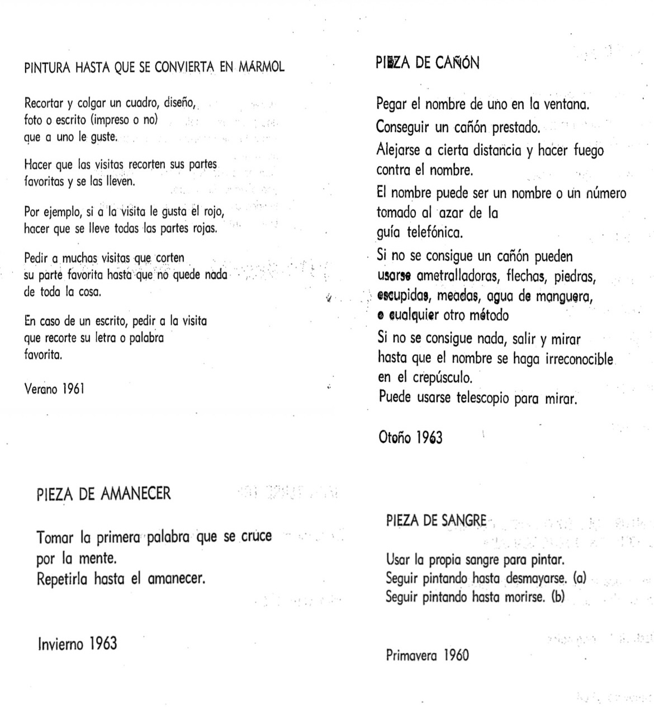

# sesion-13a

## Hablemos de placas!

Nuestras placas en proceso, ¡qué emoción! Y qué genial que cada uno podrá tener una propia. ¡MI PRIMERA PLACA, WOAH!

### ¿Cómo exportarlas?
+  Debe ser en formato Gerber.
+   Mínimo debe tener 7 capas (contorno, cobre, máscara y silkscreen).
    + Específicamente son las capas: F.Cu, B.Cu, F.SilkS, B.SilkS, F.Mask, B.Mask y Edge.Cuts.
+ Trazar.
+ Archivo de taladrado.
+ Visor Gerber (previsualizar si es coherente).

Ojo: debemos tener cuidado con no tapar los nombres de los componentes con los gráficos (ej.: U2).

¡Y todo esto cuesta mucha, mucha, MUCHA PLATA!

## Ahora hablemos de carcasas.

Ejemplo de carcasa: pedal de guitarra.

Las carcasas pueden hacerse de cualquier material.

Dato para componentes: Vitronics es más barato (es online).

___ 

Comenzamos Proyecto-03.

+ Revisar los Gerber.
+ Comparar lo que hicimos en nuestra entrega con las correcciones que nos realizaron.

¿Mismo grupo o separarse? (Mantenemos).
+ Hacer listado de materiales (necesitamos tal chip, en tal placa, etc.).
+ Soldar 3 placas de las que hicimos.
+ Propuesta de dos partituras.

___

Comentarios a los capítulos 1 y 2 de Pomelo, de Yoko Ono

**Capítulo 1:**

Lo leí súper rápido, aunque igual me quedaba enganchada en algunas frases, dándoles una vuelta, ya que me parecían chistosas o sin sentido, como la pieza de pulso o la pieza de ronquido, entre otras. También están las que me representaban en el momento, como la pieza de pared para orquesta, “pegar con la cabeza en la pared”, o la pieza de escondite, “esconderse hasta que todos se olviden de uno”. Fueron las que más me atraparon, considerando que he tenido unos meses complicados. Hasta el momento me está gustando.

**Capítulo 2:**

Nuevamente quedaba enganchada en algunos capítulos, por lo surrealista que propone algunas veces o lo irracional que sugiere hacer, como en la pieza de cocina, la pieza de cañón o la pieza de sangre. Me da esa impresión de que está escrita por alguien con una mente caótica, o que son como los pensamientos intrusivos que a veces se cruzan por la cabeza. De igual forma, hay algunos que me dan ganas de hacer, como la pintura para ser dormida o la pintura hasta que se convierta en mármol. Esta fue la que más me atrajo y la que más ganas me dieron de hacer; es la más racional de todas.

