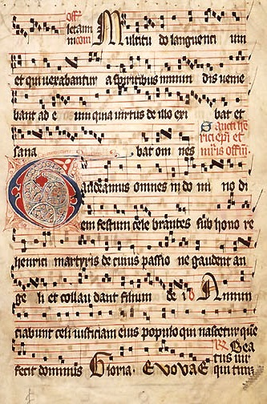
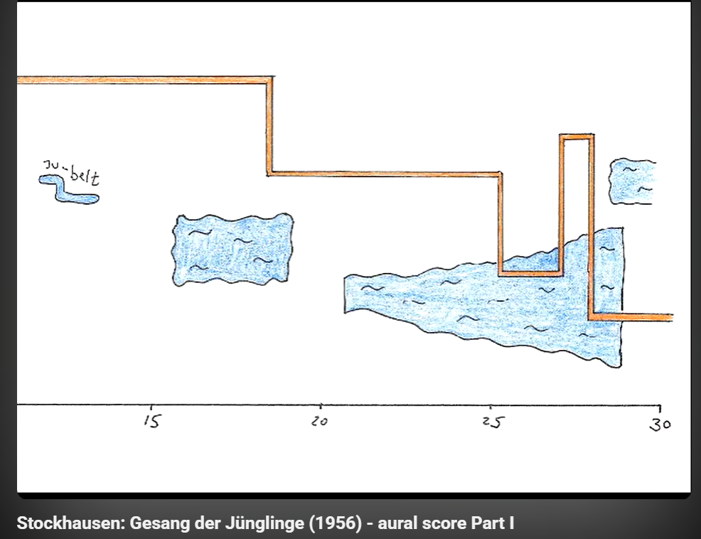
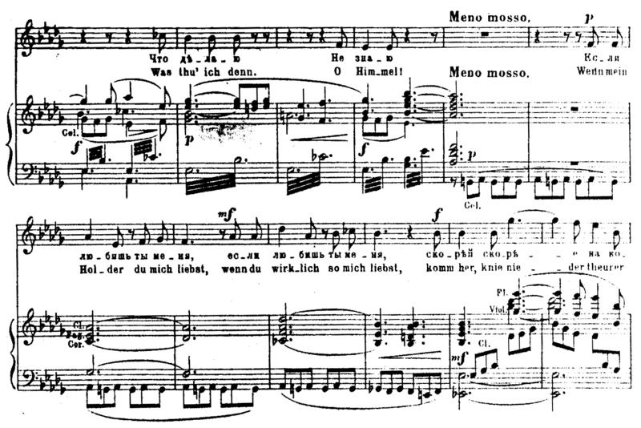
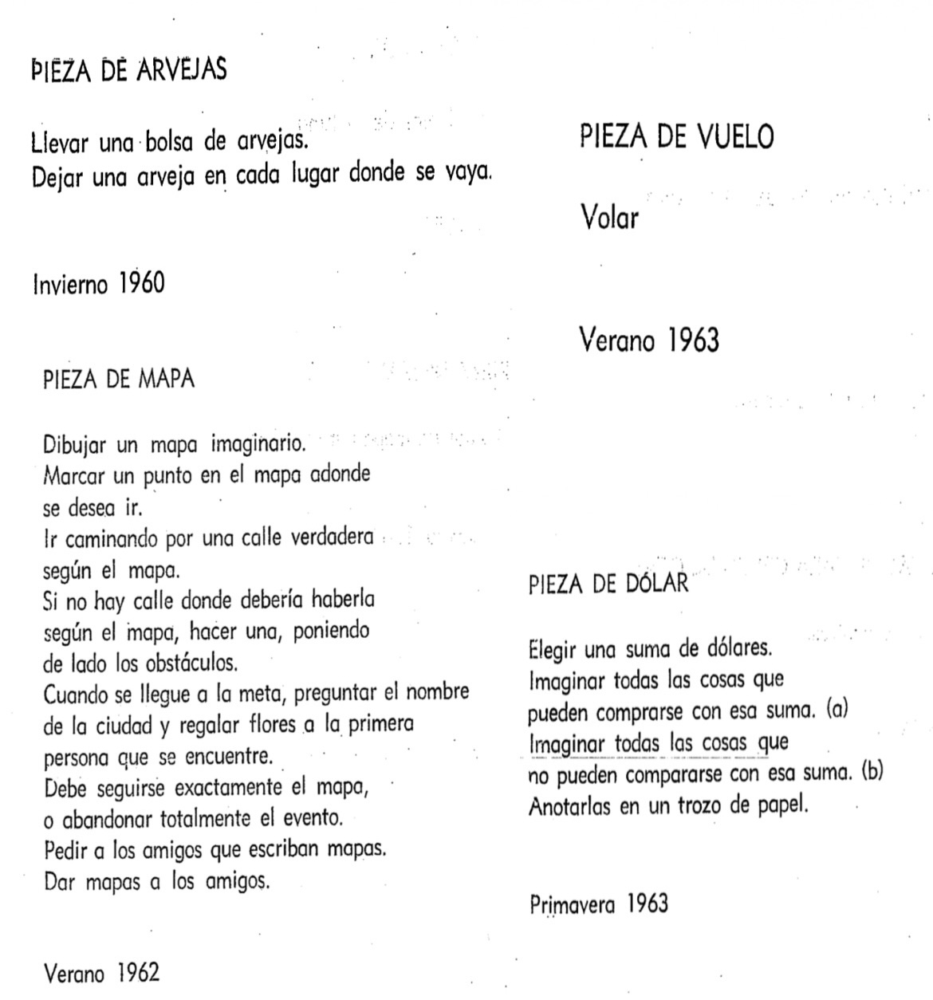

# sesion-13b

## Hablemos de partituras

**Momentos - Ritmos - Notas**

### ¿Qué son?  

Una partitura es una representación gráfica que contiene signos que expresan ideas musicales. Con una partitura podemos conocer, por ejemplo, la altura de los sonidos, su duración, la velocidad de ejecución, la intensidad, etc.

### Gregorian chants sheet

Sistema de notación musical medieval escrito sobre un tetragrama (4 líneas) que utiliza neumas (notas cuadradas) en lugar de notas redondas. No posee compás ni ritmo fijo, ya que la melodía está completamente subordinada al ritmo del texto en latín. Fue impulsado por Guido d'Arezzo en el siglo XI para unificar la música de la Iglesia católica.

### Sinfonías

Es una obra compleja para orquesta completa que generalmente se divide en cuatro movimientos con contrastes de velocidad y carácter (Rápido - Lento - Danza - Final explosivo). Sus máximos exponentes fueron Haydn, Mozart y Beethoven.

### Stockhausen sheet music
+ Karlheinz Stockhausen fue el absoluto pionero en publicar la primera partitura de música electrónica de la historia.
+ Fue el primero en demostrar que la música electrónica no era solo "ruido al azar", sino una ciencia exacta que podía ser anotada, editada y publicada en papel como cualquier obra de Bach o Beethoven.
+ Gesang der Jünglinge es la obra cumbre de la música electroacústica primitiva. Su partitura es un hito porque combina la notación de la voz humana (texto y fonética) con gráficos de frecuencias electrónicas, integrando por primera vez el control del espacio tridimensional (sonido envolvente) en el papel.

En el documental Variaciones espectrales podemos encontrar un ejemplo de las partituras que podemos realizar.

### John Cage sheet

John Cage pensaba que los compositores tradicionales (como Beethoven) eran demasiado controladores. Para él, cualquier sonido del mundo podía ser música, desde el ruido del tráfico hasta el silencio de una sala. Su gran aporte fue introducir el azar y la libertad absoluta en el arte, lo que dio origen a las partituras indeterminadas.

___

Avanzar en nuestro Proyecto 03

Buscar inspiración para nuestras partituras:
+ Plantas
+ Viento
+ Agua

Creek, de Hiroshi Yoshimura.

Serenade of Secrets, de Volodja Brodsky.

___

Comentarios a los capítulos 2 y 3 de Pomelo, de Yoko Ono

**Capítulo 3:**

Como en los capítulos anteriores, hay algunas piezas que sí me dan ganas de hacer, como la pieza de las arvejas y la pieza del vuelo. Esta última parte de una simple palabra, pero despierta muchas ganas de cumplirla: simplemente volar. También la pieza del mapa me parece interesante de realizar, al igual que la pieza del paseo, la pieza del reloj y varias más. En este capítulo sentí, mucho más que en los anteriores, ganas de llevar a cabo lo que Yoko Ono plantea, aunque siguen apareciendo acciones sin sentido y descabelladas. El término Weltinnenraum me llamó la atención; busqué su significado y se traduce del alemán como «espacio interior del mundo», pudiéndose definir como un espacio mental, emocional y onírico.

**Capítulo 4:**

Sigue la misma línea que los capítulos anteriores, hasta que llegamos a un poema para ser leído con una lupa. Me descolocó que apareciera de la nada; fue un cambio abrupto y del que no lograba leer prácticamente nada. En las páginas siguientes, la pieza del círculo no la entendí muy bien, pero me pareció interesante la de las líneas, porque realmente no hay forma de verificarla y puede ser lo que cada uno quiera que sea. ¡Me gustó! Luego, con el verdadero y el falso, sinceramente no sabía qué responder: ¿toser es una forma de amor? No logré comprender las charlas y desconecté un poco. De la lista de compras me interesaron algunas propuestas, como la máquina de desaparición, la casa de luz y el evento de nieve rosada.

