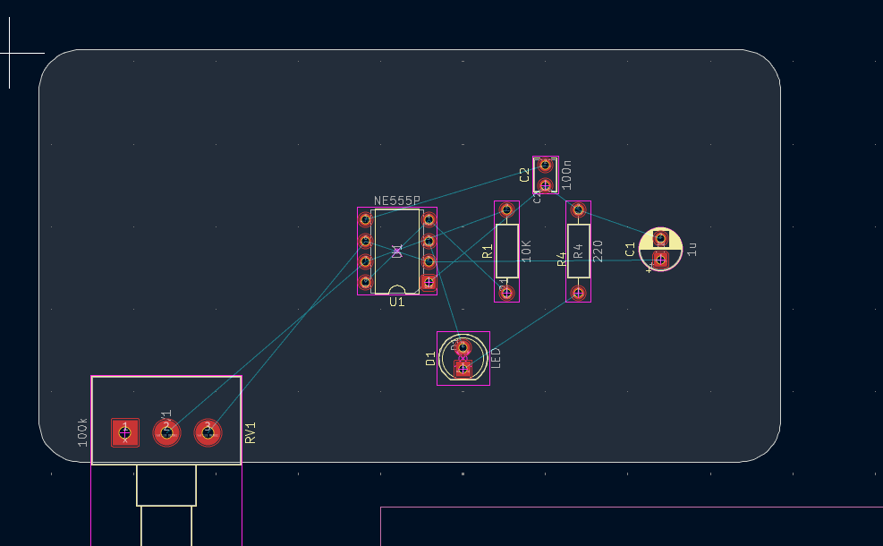

# sesion-10a

**Clase online por el incendio al lado de la FAAD.**  
La clase estuvo fome; definitivamente me motivo mucho más estando presencial.  
Menos mal no estamos en pandemia, porque creo que moriría de aburrimiento con tantas sesiones online.

---

## KiCad 

- Antes del receso vimos KiCad, pero no tan a detalle y me costaba entender varias cosas.  
- En esta sesión profundizamos más y aprendí varias cosas nuevas.  
- Al principio me costaba mucho acordarme de los pasos, pero gracias al orden de **Misaa** pude organizar bien la secuencia en mi cabeza.  
- Obviamente aprendo mucho más realizando las cosas, así que me ayudó mucho que la sesión estuviera **grabada**.  
- En la clase puse atención, claro, pero después al verla grabada pude repetir y repetir hasta quedar sin dudas de los pasos.  
  Tengo muy mala memoria :( así que la grabación fue clave para reforzar lo aprendido.

---

## Encargo 10A

  **Esquemáticos y PCB en KiCad**  
 Cada estudiante debe tomar **2 de las 4 secciones distintas** del sintetizador realizado en el Proyecto 1.  
 Crear un proyecto en KiCad por cada sección, que contenga tanto el **esquemático** como la **PCB**.  
 Anotar cada paso en la **bitácora**, incluyendo:  
  - Mayores aprendizajes  
  - Dificultades encontradas  
  - Problemas y dudas que quieran que abordemos en la próxima clase  

###  Mi avance
- Hice **dos esquemáticos**.  
  En el primero me demoré un montón, pero no tuve muchos errores porque me lo tomé con calma.  
  Como es algo nuevo todavía no me acostumbro al 100%, pero la práctica me está ayudando a mejorar.  
  Aún no entiendo bien lo de **asignar huellas**: me confunde por qué algunas son tan específicas y cómo saber si estoy poniendo la correcta.  

### Atajos y herramientas útiles en KiCad
- **A** = herramienta agregar símbolo  
- **ESC** = herramienta selección  
- **M** = mover componentes  
- **G** = mover componente con todo lo que tiene conectado  
- **V** = asignar valor a componente  
- **E** = editar/revisar hoja de vida del componente  
- **F** = revisar huella asignada al componente  
- **CMD + S / CTRL + S** = guardar  
 .

### Pasos para crear el proyecto en KiCad (grcaias misaa también)
1. Dibujar esquemático (.kicad_sch)  
2. Asignar huellas a símbolos  
3. Abrir PCB New (para crear la PCB), intérprete del esquemático  
4. Definir tamaño de las pistas  
5. Repartir componentes físicamente  
6. Rutear componentes  
7. Ornamentar y exportar fabricación  
\* Quizás tenga que crear o descargar mis propias huellas y símbolos

Esquemático 1
 .

 .
 
  .

  
  
  .
  
  .
   
  .
   

---

## Mayores aprendizajes

- Aprendí lo básico de **KiCad**, que antes veía como algo de otro planeta.  
- Al principio me parecía **súper difícil**, pensaba que me iba a costar mucho, mucho.  
- Pero con práctica y paciencia fui entendiendo cómo funciona y cada vez se me hace más familiar.  

---

## Personals antoloch yo misma 

 Durante este semestre me he sentido **muy orgullosa de mí misma**. Normalmente no soy de esas personas que se tiran para adelante, siempre había algún motivo que me frenaba. Pero ahora he seguido aprendiendo, he seguido mejorando, y estoy orgullosa del cambio de visión que he tenido, incluso muestro mis trabajos a todo el mundo, no me escondo. He conversado con distintas personas que también saben de electricidad, y gracias a esas conversaciones he aprendido muchísimo más. Lo más bonito es que incluso personas cercanas a mí, que no sabía que tenían conocimientos de electricidad, me han sorprendido y enseñado cosas nuevas.  

lectura de libro de Flusser, capítulo 1

##  Dos vistas
- El registro: la imagen misma.  
- La vista del observador: depende de quién la mira.  
- La imagen no tiene un significado único, cada persona la interpreta de diferentes maneras.  
- Genera distintas emociones, lecturas e interpretaciones.  
- Son connotativas: una imagen puede transmitir tristeza, nostalgia, felicidad, etc., aunque no sea explícito.  
- Las imágenes tienen un significado mágico: producen emociones rápidas, simbólicas, y muchas veces reaccionamos antes de analizarlas.  
- La imagen tiene mucho poder.  

---

## Idolatría
- Ocurre cuando olvidamos que la imagen es una representación.  
- Entonces las personas empiezan a creer que la imagen es la realidad.  
- Ejemplo de la actualidad: las redes sociales y la publicidad.  
  -  yo siempr me comparaba (cuando era mas petite),  físicamente con mujeres de redes sociales que quizás ni siquiera eran reales  y esten editadas, filtradas, etc...  
  - a muchas mujeres les pasa, en las publicidades y en redes sociales en general.  
- Por eso tenemos que tener la visión crítica de que no todo lo que vemos es realmente como se ve.  

---

## conciencia histórica y conciencia mágica
- Flusser habla de dos maneras:  
  - **Conciencia mágica**: relacionada con las imágenes.  
  - **Conciencia histórica**: relacionada con el texto y la escritura.  
- Existe una tensión entre pensar críticamente o dejarse llevar por imágenes y símbolos.  

##  Textolatría y   Idolatría
- **Idolatría**: adornar imágenes y creer ciegamente en ellas.  
- **Textolatría**: creer que los textos y conceptos explican absolutamente todo.  
- tanto las imágenes como los textos pueden dominar nuestra forma de pensar.  

##  Imágenes y texto
- **Imagen**: inmediata, emocional, abierta a interpretación.  
- **Texto**: lineal, racional, explicativo.  
- Son distintas formas de ver y entender el mundo.  

- Bueno, el capítulo me hizo pensar mucho sobre la realidad en la que vivimos.  
- Vivimos llenos de imágenes que consumimos sin analizarlas realmente.  
- Es importante tener conciencia crítica y no dejarnos dominar ni por las imágenes ni por los textos.  

