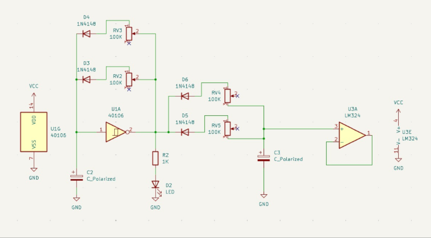
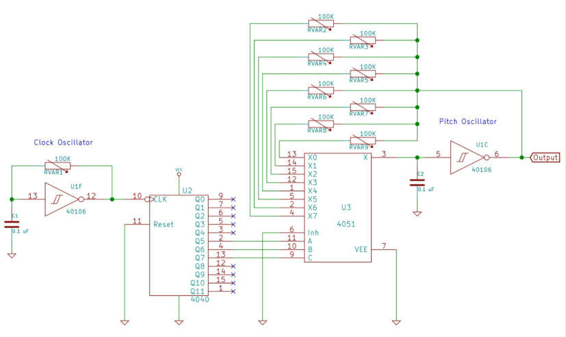

# sesion-11a

## trabajo en clases

### propuesta 01
Esta propuesta tiene una onda cuadrada intervenida por attack y decay con los chips 4016 y LM324. En español estos conceptos significan ataque y decaimiento. 

"Attack y Decay son las dos primeras fases de la envolvente ADSR (Attack, Decay, Sustain, Release) : _(Ataque, decaimiento, sostenimiento, liberación)_, un sistema utilizado en producción musical y diseño de sonido para controlar cómo evoluciona el volumen (o el tono) de un sonido a lo largo del tiempo" _https://zaksound.com/es/blog/what-is-adsr_

- **A (Attack / Ataque):** **Es el tiempo que tarda en aparecer la nota. También se puede interpretar como un "fade in".**

- **D (Decay / Decaimiento):** El decay es el tiempo entre el attack y el sustain. **En otras palabras, cuánto tardará en alcanzar el nivel máximo de sustain después del attack.**

- S (Sustain / Sostenimiento): Es un parámetro de nivel, no de tiempo. Es el volumen al que llega la nota tras el decay. El volumen se mantendrá en este nivel mientras mantengas pulsada la nota (si es un sintetizador). Si es un instrumento sampleado, no durará para siempre.

- R (Release / Liberación): Después de soltar la nota, es el tiempo que tarda el sonido en desaparecer.

### propuesta 02

Esta propuesta contiene los chips 40106, 4040 y 4051 y lo encontramos en internet: 

https://hackaday.com/2015/02/23/logic-noise-the-switching-sequencer/

Por el momento vamos avanzando en la primera propuesta que es la que más llama nuestra atención, pero no hemos logrado hacerla sonar.

-----------------------------------------------------------------------------------------------------------------

## análisis libros: capítulos 8 y 9

### capítulo 8: el universo fotográfico

- "Nos hemos habituado tanto a ellas _(las fotografías)_ que ni siquiera advertimos su presencia en derredor nuestro: el hábito las oculta."
- "Este es el reto del universo fotgráfico, el reto para el fotógrafo: cómo oponerse al flujo de fotografías redundantes con fotografías verdaderamente informativas."
- "Nos hemos acostumbrado a la contaminación visual, y ésta de nuestros ojos y de nuestra conciencia hasta las regiones subliminales sin que de hecho nos demos cuenta."

tengo que seguir subiendo los apuntes!
