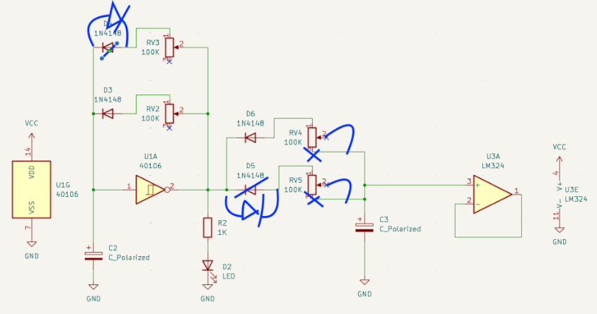
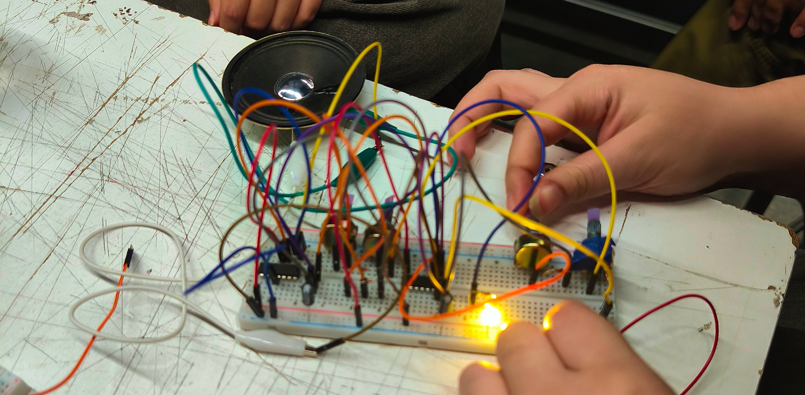
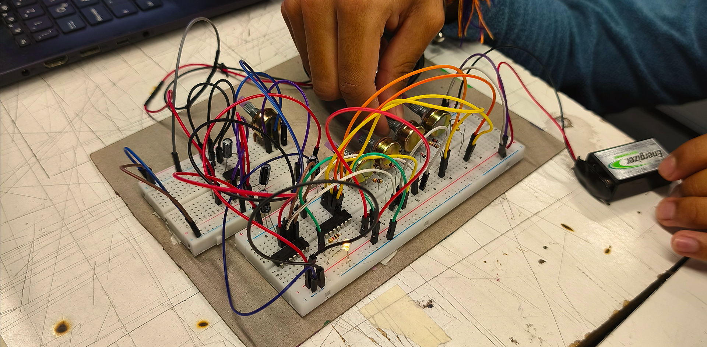

# sesion-11b

## trabajo en clases

En esta clase avanzamos en paralelo con la propuesta 02 para poder avanzarla. La propuesta 01 estaba funcionando, pero sonaba con un volumen bastante bajo. Así que le pedimos ayuda a Aarón y Misa y logramos llegar al problema!

1. Faltaba un amplificador, creíamos que con el LM325 era suficiente, pero no. Así que tuvimos que sumar un 386 a la salida con un parlante.
2. La mayoría de los errores estaba en el esquemático, el cual Misa nos ayudó a corregir:

### fotos de los circuitos en clases

Hasta este día, antes de aplicar todas las correcciones, tuvimos bastantes complicaciones en hacer que los circuitos sonaran por lo que estábamos preocupados, pero tratando de mantener la calma, así que decidimos que el martes iba a ser el día donde hicieramos que todo funcionara.
