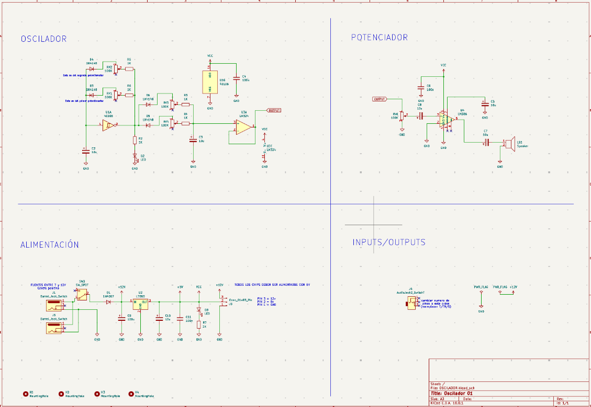
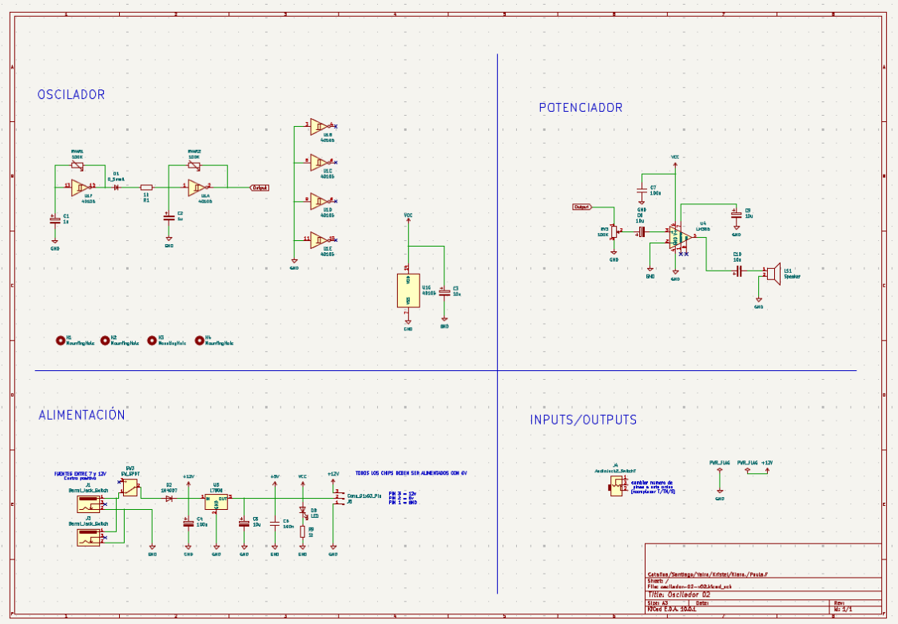
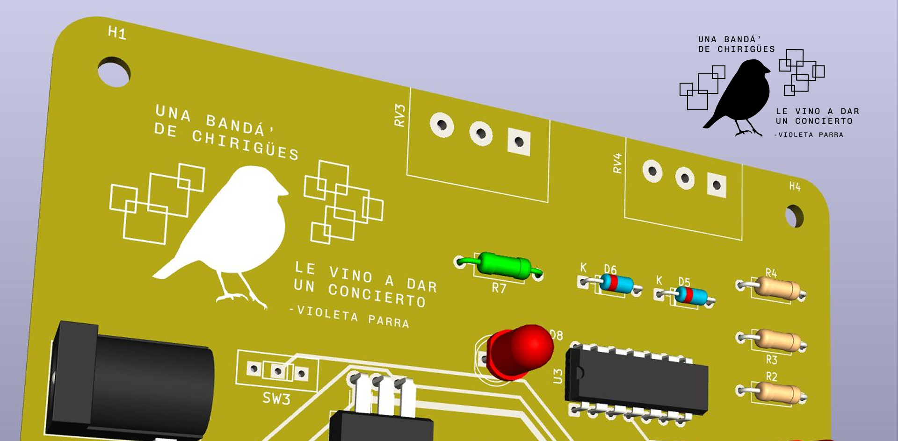
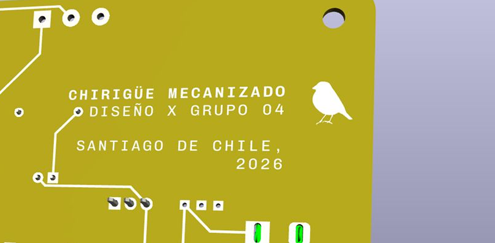
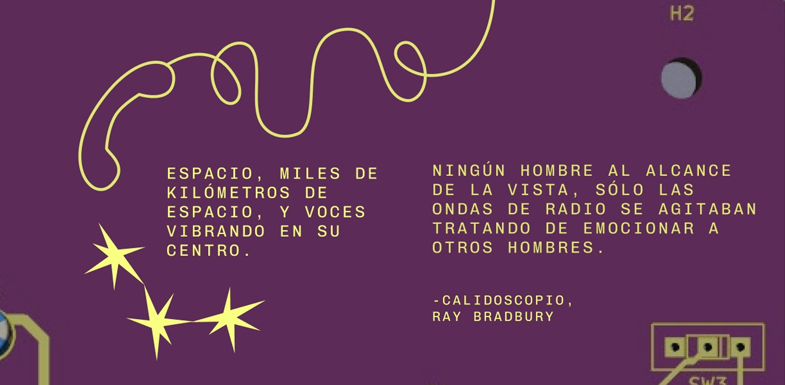
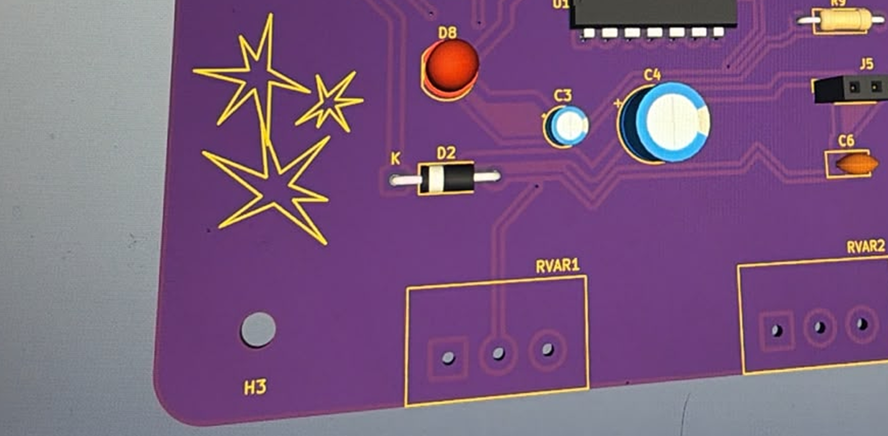

# sesion-12a

## trabajo en clases ✶ _procesos de la semana_
El martes fue el día más intenso, ya que teníamos la presión de hacer que el proyecto 02 quedara funcionando completamente, sabiendo que iba a ser la última vez que íbamos a coincidir todos como grupo presencialmente, por temas de tiempo, antes de la entrega. Gracias a las correcciones de Misa, logramos hacer sonar el Circuito 01 en clases! y este fue nuestro nuevo esquemático:

El Circuito 02 fue el que más nos complicó desde un principio y no logró sonar en la clase, así que Paula se lo llevó para poder ver que estaba pasando. Parecía que nuestros chips eran los que no funcionaban luego de probar varias cosas, y teníamos dos opciones: la primera, era esperar hasta el otro día e ir a comprar nuevos chips; la segunda, era probar otra propuesta con chips que ya teníamos, que finalmente era la más inteligente para ahorrar tiempo.

La sacamos de acá:

https://hackaday-com.translate.goog/2015/02/04/logic-noise-sweet-sweet-oscillator-sounds/?_x_tr_sl=en&_x_tr_tl=es&_x_tr_hl=es&_x_tr_pto=tc

En un principio sonaba muy parecido a un teléfono, pero en un momento empezaron a fallar los potenciometros, y al cambiarlos el sonido se modificó, pero logró mantener algo de la melodía característica que luego daría paso a la conceptualización.

## conceptualización propuestas

### chirihue mecanizado 𓅫
Este nombre surgió de la idea de Santiago, quien en clases nos empezó a preguntar por música chilena y llegó a Inti Illimani, y encontró la canción de la Exiliada del Sur que hablaba de _una banda de chirigües que viene a dar un concierto._ Él escuchó su canto y relacionó el parecido con el sonido de nuestro circuito. Por otra parte, yo investigué del contexto y llegamos a que la letra es originalmente de Violeta Parra, y que incluso es un poema sin título, pero este ha sido musicalizado por distintos artistas como Patricio Manns, quien la llamó El Exiliado del Sur y quitó esta última parte; luego por Inti Illimani (la más popular), donde vuelven a rescatar estos últimos versos y le dan el nombre que corresponde: La Exiliada del Sur, ya que cuenta una historia autobiográfica de Violeta; y la última interpretación fue por Los Bunkers.

_Desembarcando en Riñihue_

_Se vio la Violeta Parra_

_Sin cuerdas en la guitarra_

_Sin hojas en el coligüe_

_Una banda de chirigües_

_Le vino a dar un concierto_

También al realizar esta conceptualización, creí que era necesario mencionar la condición de la máquina de no poder igualar la naturaleza por más que lo intente, sólo intenta imitarla, haciendo que su resultado sea una reinterpretación de lo natural.

También ayudé a mis compañeras que estaban realizando los archivos de la PCB (Yaira con la primera, Kiara con la segunda) con unas gráficas para reforzar la idea del concepto.

**Diseño para chirihue mecanizado:**

### comunicaciones espaciales

Esta idea surgió bajo el sonido que tenía similar a un teléfono y así llegó el concepto de comunicaciones, y pensé cómo es qué podíamos darle una vuelta más poética y se me ocurrió el apellido espaciales, pensando en la lógica satelital de la comunicación. Kriss bajo esta idea general generó una narrativa más completa, y para seguir profundizando en eso recordé un cuento que leí, Caleidoscopio de Ray Bradbury, un autor de ciencia ficción que cuenta la historia de unos astronautas, a quienes les explota la nave en la que van y los sobrevivientes quedan flotando en el espacio, reflexionando sobre la vida al esperar la muerte, mientras se comunican por radio. Al releer el cuento llegué a esta frase muy linda y que encontré muy adecuada:

_Espacio, miles de kilómetros de espacio, y voces vibrando en su centro. Ningún hombre al alcance de la vista, sólo las ondas de radio se agitaban tratando de emocionar a otros hombres._

**Diseño para comunicaciones espaciales:**

