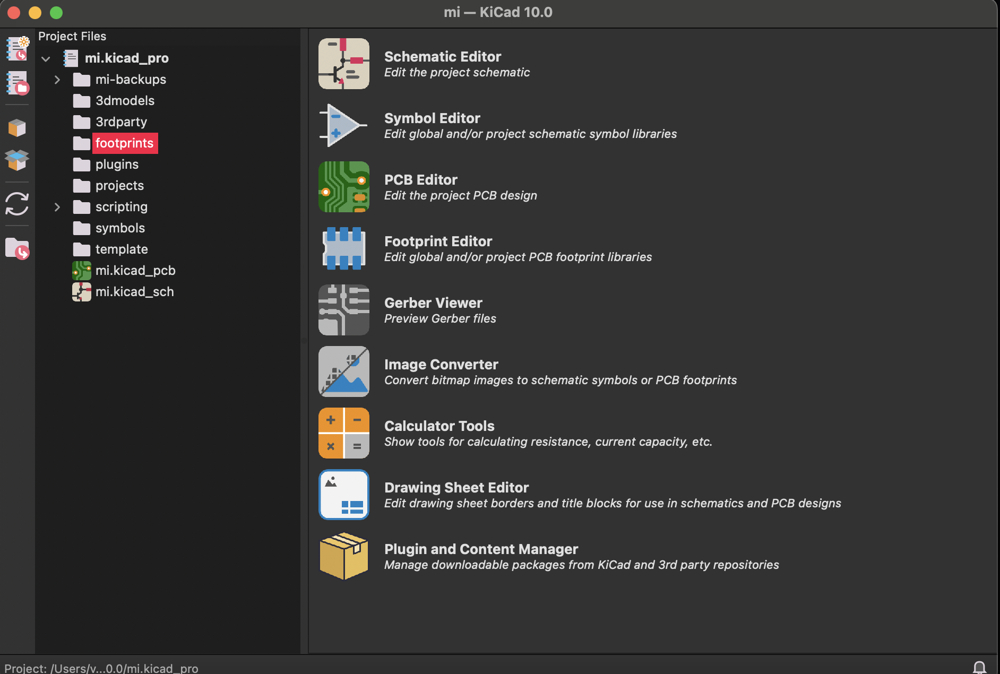
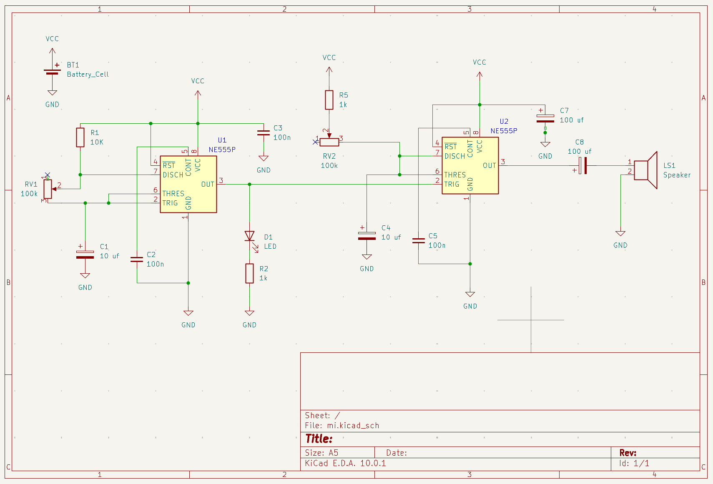
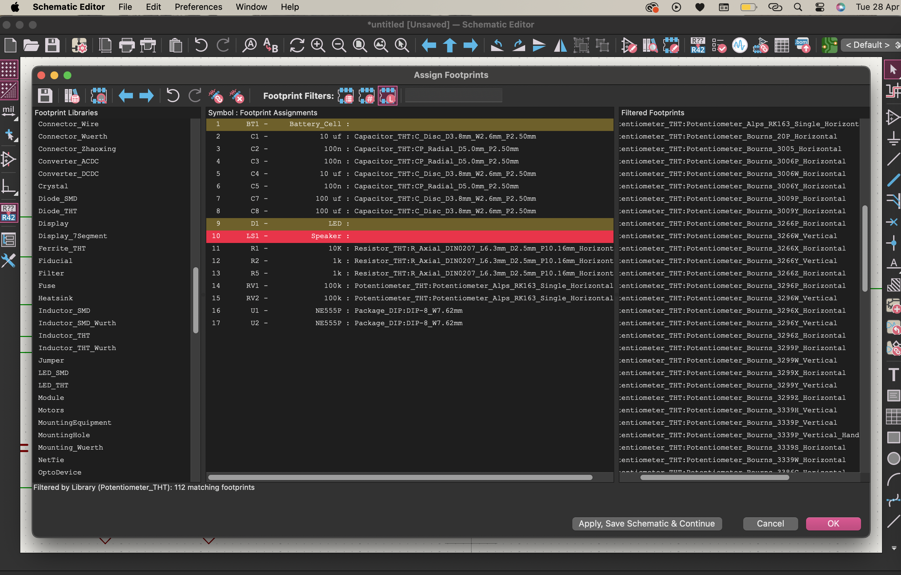
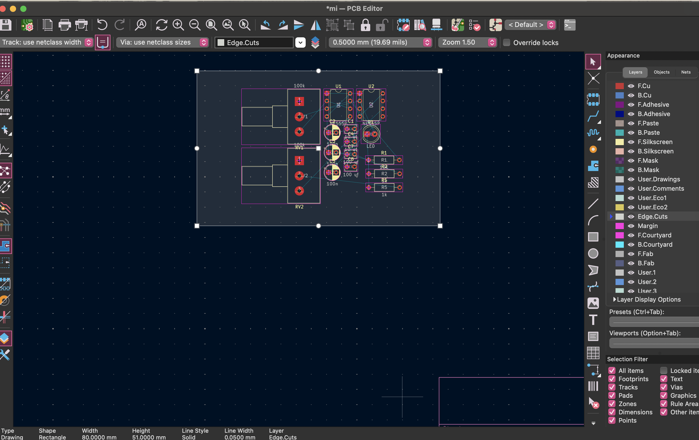

# sesion-08a 27.04.26

## KiCad

**Ryosuke Kiyasu**, un músico y percusionista japonés conocido por sus solos de caja (*snare drum*) experimentales y de ruido (*noise*)

- **Símbolos** -> abstractos, esquemáticos
- **Huellas** -> PCB, el mundo físico
- Aristóteles -> **[Género – Especie – Individuo]** que en KiCad se traduce como **THT – Resistor – R2**

Todos los esquemáticos que leímos durante el semestre fueron hechos acá. Ocupe kicad para la entrega del primer proyecto, lo use a la intuicióny al equivocándose se aprende jajaj con esta clase caché varias cosas que me hubieran facilitado la vida esa vez, aunque fácilmente hubiera podido ver un tutorial o leer como se usa pero era bastante intuitivo.

Hay un archivo central (`.kicad_pro`) que enlaza todo lo demás.

| Extensión       | Qué es          |
|-----------------|-----------------|
| `.kicad_pro`    | El proyecto     |
| `.kicad_sch`    | El esquemático  |
| `.kicad_pcb`    | La PCB          |

Importante abrir nuestro proyecto desde la extensión pro asi sabemos que estan conectados.

---

## El flujo completo (esta clase hicimos los 3 primeros pasos)

| Paso | Acción | Descripción |
|------|--------|-------------|
| 1 | Dibujar el esquemático (`.kicad_sch`) | Crear el diagrama lógico del circuito |
| 2 | Asociar huellas a símbolos | Vincular lo físico (PCB) con lo conceptual (esquema) |
| 3 | Abrir PCB Editor (*PCB New*) | Importar el esquemático para comenzar el diseño de la placa |
| 4 | Definir tamaños de pistas | Establecer grosores según requerimientos eléctricos |
| 5 | Distribuir componentes | Ubicar los elementos en la placa de forma estratégica |
| 6 | Rutear conexiones | Dibujar las pistas que conectan los componentes |
| 7 | Preparar para fabricación | Añadir bordes, textos, capas, etc. |

## Paso 1 — Dibujar el esquemático

Abrimos el `.kicad_sch` y empezamos a colocar componentes. Luego los conectamos con cables. A cada componente hay que hacerle doble clic para asignarle un valor. Esos valores son referenciales, para que alguien pueda leer el esquemático; no afectan la PCB directamente.

Cosas:

- El **potenciómetro** se busca como `R_pot` pq es una resistencia
- La `X` es la marca de **no conexión** (cuando un pin queda libre a propósito), siempre ponerlo si es que dejamos un pin libre.
- **Pitch** = separación entre pines

Mi esquemático:

Use el mismo que hice para el proyecto 01, porque ya lo tenia hecho.

## Paso 2 - Asociar huellas a símbolos

- **Símbolo** = representación conceptual del componente en el esquemático
- **Huella** = el espacio físico que ese componente ocupa en la PCB real

Se abre el diálogo *Assign Footprints* y se asocia cada símbolo con su huella correspondiente según el tipo (THT o SMD) y tamaño físico.

*Despues me di cuenta que puse las huellas de los cond cerámicos y polarizados al revés, y no alcancé a cachar cual pusieron en la bateria y el parlante, además no sé porqué mi parlante aparece como ls y el de misa como spk*

Las huellas que usamos:

| Componente | Huella |
|------------|--------|
| Condensador cerámico | `Capacitor_THT:CP_Radial_D5.0mm_P2.50mm` |
| Condensador electrolítico | `Capacitor_THT:C_Disc_D3.8mm_W2.6mm_P2.50mm` |
| Resistencia | `Resistor_THT:R_Axial_DIN0207_L6.3mm_D2.5mm_P10.16mm_Horizontal` |
| Potenciómetro | `Potentiometer_THT:Potentiometer_Alps_RK163_Single_Horizontal` |
| LED | `LED_THT:LED_D5.0mm` |

Para saber las huellas correctas es importante revisar las características de los componentes, eso se puede hacer en las mismas páginas dónde los venden.

---

## Paso 3 — Abrir PCB

Desde el editor de esquemático se abre el PCB Editor, y aparecen todos los componentes listos para distribuir. Acá termina lo que alcanzamos a hacer en clase.

Luego hice un contorno porque da error si no lo haces, importante hacerlo en la capa correcta.

