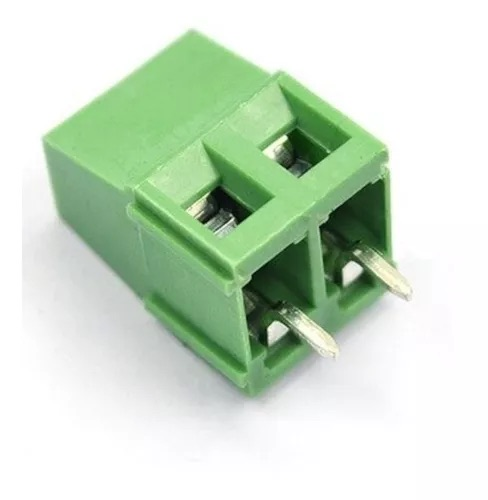
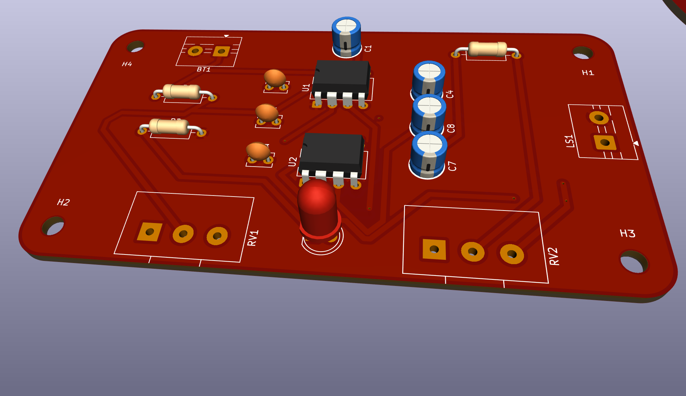
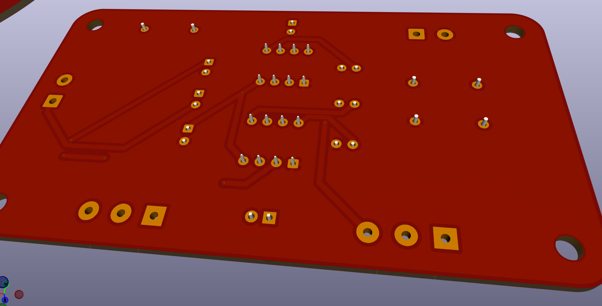
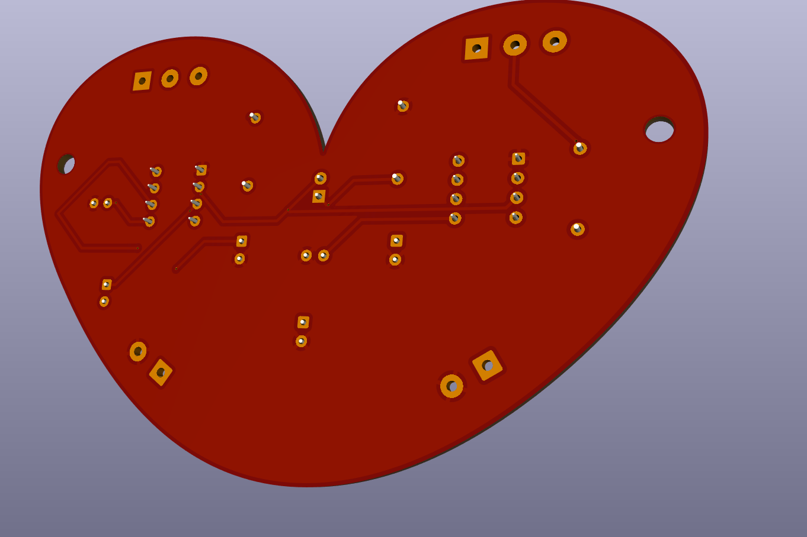

# Sesión 10a — 12.05

> Online por el incendio

## KiCad — Atajos de teclado

| Tecla | Qué hace |
|-------|----------|
| `A` | Agregar componente |
| `R` | Rotar componente |
| `G` | *Grab* — mueve el componente arrastrando los cables conectados |
| `M` | Mover (sin arrastrar cables). Primero `Esc` para volver al modo selección, clic en el componente y luego `M` |
| `E` | Editar propiedades (nombre, valor, huella, hoja de datos) |
| `V` | Asignar valor a un componente / cambiar de capa cobre frontal a la de atrás (en PCB) |
| `X` | Reflejar en eje X |
| `I` | Reflejar en eje Y |
| `Esc` | Herramienta de selección |
| `Cmd + D` | Duplicar componente |
| `Cmd + Z` | Deshacer |
| `Option + 3` | Abrir visor 3D |

## KiCad - Conceptos

### Agregar componentes
- En el menú de componentes, `R` filtra resistencias directamente.
- También se puede buscar por nombre: `LED`, `VCC`, `GND`, etc.
- Si algo queda sin conectar, hay que ponerle la **X de no conexión**, si no, el DRC se va a quejar.

### Huellas (*Footprints*)
- Son el estado físico del componente, es decir, cómo va a quedar en la placa real.
- Si están mal -> todo está mal
- El nombre sigue el formato: **ESPECIE / INDIVIDUO** (tipo de componente / variante específica).

### Tabla de información de la hoja
- Doble clic en la tabla roja para editar el tamaño de página y los metadatos del esquemático.

---

## PCB — Diseño de la placa

### Configuración inicial
- Métrica de grilla recomendada para empezar: **5 mm**.
- Para dibujar el contorno de la placa, **siempre en la capa `Edge.Cuts`**, esto es **importante**, no dibujarlo en otra capa.

### Contorno
Para las esquinas redondeadas hay dos caminos:
1. Herramienta de arco: primero se marca el centro, luego el inicio y el final del arco.
2. Dibujar un rectángulo, seleccionarlo, presionar `E`, activar "rectángulo redondeado" y poner **5 mm** de radio.

### Pistas (caminos de cobre)
- Son los "cables" de la placa y pueden ir en cualquier lado.
- El grosor depende de cuánta corriente necesita pasar:
  - VCC → más grueso, **0.8 mm** o más.
  - Señales → pueden ser más delgadas. **0.4mm**

### Criterio de diseño
- **Siempre positivo hacia arriba**, orientación de componentes.

### Vías
- Permiten conectar ambos lados de la placa con la misma ruta.
- Se dibuja la pista y se aprieta `V` para cambiar de lado, dejando una vía en ese punto.

### GND en plano de cobre
- Para el ground no conectamos pista a pista: seleccionamos ambas caras de la placa y hacemos que toda la placa sea GND como plano de cobre. Luego para que se rellene ocupamos `B` de Bold.

### DRC (*Design Rule Check*)
- El ícono con el checklist arriba a la derecha.
- Corre siempre antes de mandar a fabricar para asegurarse de que no quedó nada mal conectado o con errores de diseño.

### Agujeros de montaje
- En el esquemático de KiCad, agregar el componente **MountingHole**.
- Luego ubicarlo en la placa como cualquier otro componente.

### Importar gráficos (DXF / SVG)
- Ir a `Archivo → Importar → Gráficos`.
- **Importante**: ponerlos en una capa de serigrafía (*Silkscreen*), no en cobre.

---

### Terminal block
Pequeño dispositivo que permite sujetar cables atornillándolos. Hay que asegurarse de que tenga **5 mm de espaciado** entre pines.

* [KF301-2 en Mechatronic Store](https://www.mechatronicstore.cl/conector-terminal-2-pines-con-tornillo-kf301-2/)

---
#### Mi Placa

## encargo-09a

### esquemáticos y PCB en KiCad

cada estudiante debe tomar 2 de las 4 secciones distintas del sintetizador realizado en el proyecto 1, y crear un proyecto en KiCad por cada una, que contenga tanto el esquemático y la PCB de cada sección.

anotar cada paso en la bitácora, incluyendo mayores aprendizajes y dificultades encontradas, además de problemas y dudas que quieran que abordemos en la próxima clase.

### lectura de libro de Flusser, capítulo 1

leer introducción y capítulo 1 del libro Hacia una filosofía de la fotografía, de Vilém Flusser, disponible en <https://monoskop.org/images/8/8d/Flusser_Vilem_Hacia_una_filosofia_de_la_fotografia.pdf>

compartir apuntes y reflexiones críticas sobre el texto, prohibido usar inteligencia artificial, no sirve para este ejercicio.

