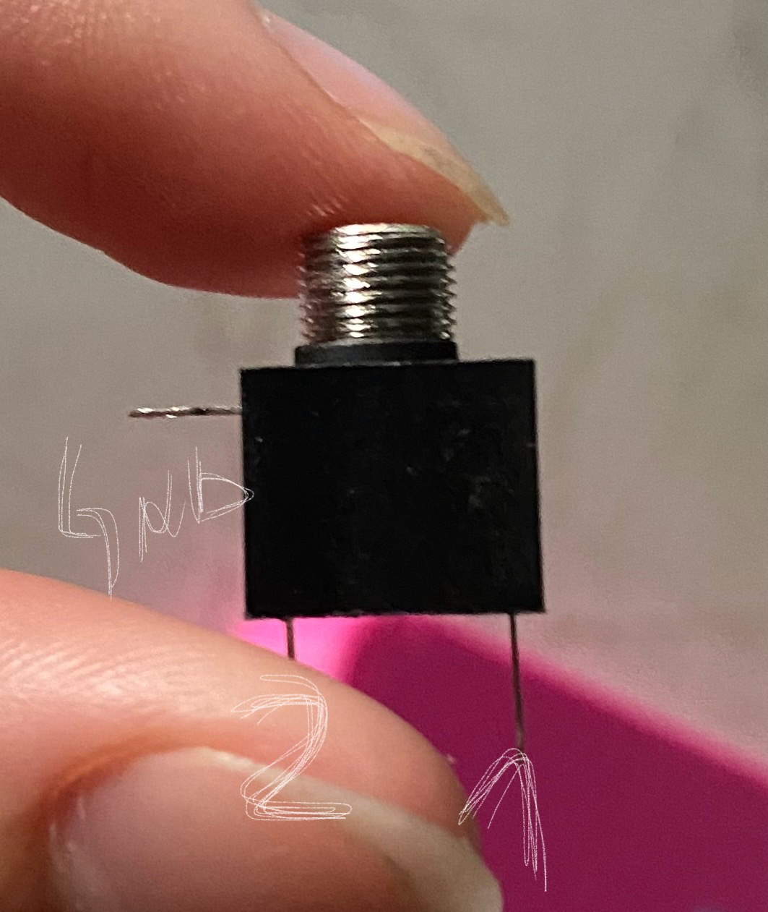
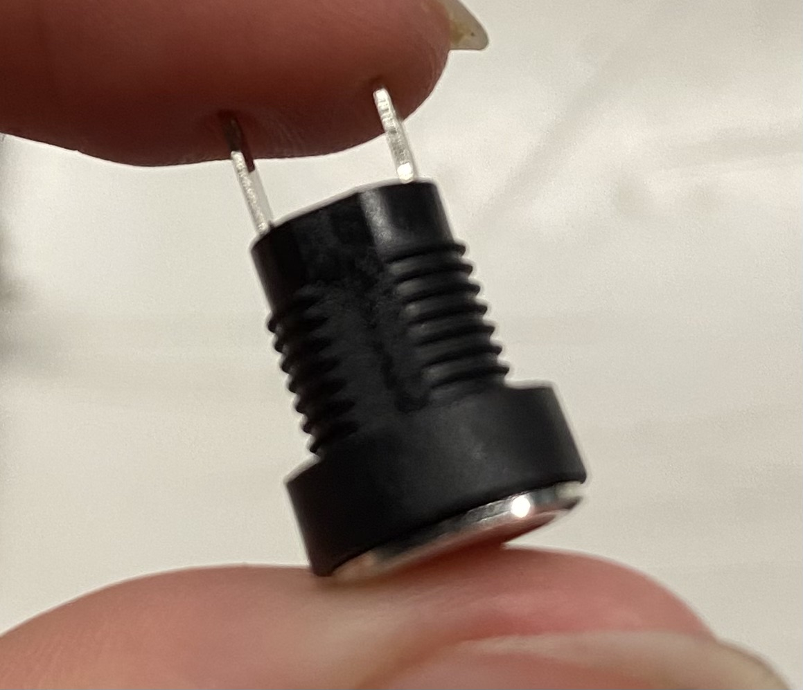
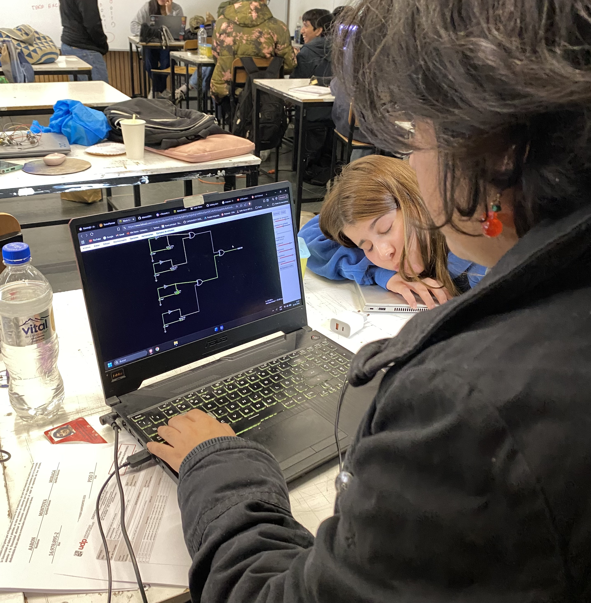

# sesion-11b

29 de mayo 2026

Entender en qué soy mediocre, en qué soy mediocre y me gusta, en qué soy bueno pero no me gusta hacer y estar bien con eso.

---

<https://en.wikipedia.org/wiki/Phone_connector_(audio)>

Conector TS, hay varios tamaños, pero todos de la familia TS.

Se ocupan para los que haremos nosotros, en guitarras, máquinas para tatuar... Usualmente se ocupa el "S" para GND, la tierra es la señal mas grande de conexión.

La punta es la señal que quiero enviar. La patita 2 se usa para saber si hay algo conectado.

- Bracito como GND (pin1)
- Bracito 1 Señal (pin 3)
- Bracito 2 Switch (pin 2)

Barrel switch:
- 1 conectado a la señal.
- 2 conectado a gnd
  

Como segundo circuito de nuestro proyecto quisimos recrear este esquemático que encontramos en el libro "Make: Electronic music from scratch" que se llama "INHARMONIC_SQUARE_WAVES"

Nico hizo el esquemátco del circuito en Kicad.

Y Carla hizo el circuito en Falstad

  
---
### Capítulo 5

**Maniqueismo:** El universo está constantemente en una lucha entre un ser de luz bueno y un mal oscuro. Es la doctrina que se basa en un dualismo radical que dividía el universo en dos fuerzas cósmicas en conflicto eterno: el Bien (la Luz) y el Mal (la Oscuridad/Materia)

Vivimos en un mundo que está abstraido. El el mundo opera, tiene colores, formas raras, y lo abstraemos a blanco y negro.

**Lógica aristotélica** se centra en el análisis de los argumentos y la estructura de las proposiciones, utilizando el silogismo como herramienta principal para llegar a conclusiones válidas y necesarias a través de la razón.

> Hablamos del mundo muy juciosamente, que es lo bueno y qué es lo malo?
