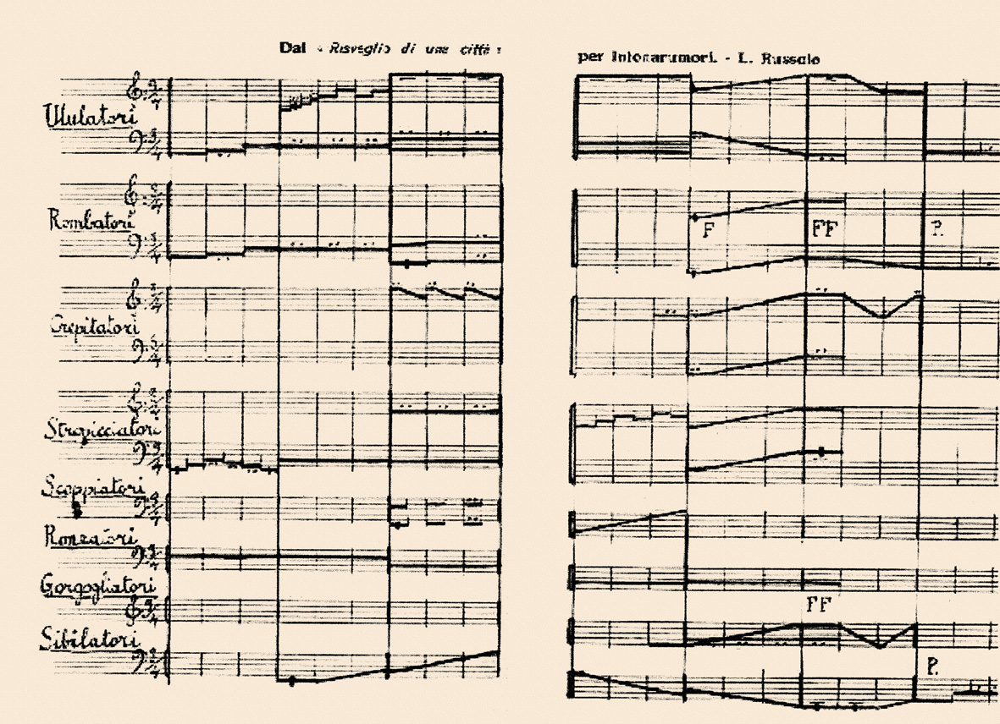
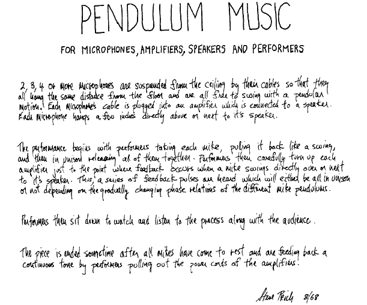

# sesion-13b

12 de junio 2026

---

## Partituras

Es como un esquemático pero no te dice de que valor son las resistencias.

> Hay muchas formas de escribir la música.

### Ejemplos:

<https://youtu.be/sJ9EZWBZee8?si=SXXWUU2L4tISLEjh&t=1684>

<https://www.youtube.com/watch?v=fU6qDeJPT-w>

> Declarar TODO

Pueden sonar más cosas además de el sintetizador.

---

Debemos presentar nuestro trabajo a la comisión como Sergio Lagos presentó a Daddy Yankee en viña 2006.

---
### Avance proyecto 03

Esta clase comenzamos a hacer nuestro BOM, para eso necesitabamos decidir con qué otros circuitos de nuestros compañeros queríamos trabajar.

Decidimos que queríamos trabajar con estos: 

- Barry benson (Abeja) - percutor 
- Lub-dub (Corazón) - percutor 
- Chirihue Mecanizado (Pájaro) - oscilador <https://github.com/terroiblea/dis8644-2026-1-procesos-2/tree/main/00-proyecto-02/grupo-04>

Queremos formar algo así como un "ecosistema".

Este es nuestro BOM por ahora:

## BOM

| Componente | Cantidad | Precio (c/u) | Comprar |
|------------|----------|--------------|---------|
| Chip 4069UBE | 1 | $1.100 | <https://www.cabezacuadrada.cl/product/cd4069/> |
| Chip CD40106BE | 3 | $750 | <https://www.cabezacuadrada.cl/product/cd40106be/> |
| Chip LM324 | 1 |
| Potenciómetro 100K | 8 | $490 | <https://www.mechatronicstore.cl/potenciometro-rotacional-10k/> |
| Potenciómetro 250K | 4 | $495 | <https://altronics.cl/potenciometro-lineal-250k-b250k> |
| Capacitor no polarizado 100nF | 6 | $100 | <https://www.mechatronicstore.cl/condensadores-ceramicos-distintos-valores/> |
| Capacitor no polarizado 10nF | 1 | $100 | <https://www.mechatronicstore.cl/condensadores-ceramicos-distintos-valores/> |
| Capacitor polarizado 10uF 50V | 6 | $100 | <https://www.mechatronicstore.cl/condensador-capacitorio-de-electrolitico-por-unidad-varios-valores/> |
| Capacitor polarizado 0.22uF 50V | 1 | $100 | <https://www.mechatronicstore.cl/condensador-capacitorio-de-electrolitico-por-unidad-varios-valores/> |
| Capacitor polarizado 100uF 50V | 4 | $100 | <https://www.mechatronicstore.cl/condensador-capacitorio-de-electrolitico-por-unidad-varios-valores/> |
| Capacitor polarizado 1uF 50V | 1 | $100 | <https://www.mechatronicstore.cl/condensador-capacitorio-de-electrolitico-por-unidad-varios-valores/> |
| Resistencia 100K | 1 | $100 | <https://www.mechatronicstore.cl/resistencias-electricas-1-2-w-1-unidad/> |
| Resistencia 1K | 4+5* | $200 | <https://www.mechatronicstore.cl/resistencias-electricas-3w-por-unidad/> |
| Diodo 1N4007 | 2 | $200 | <https://www.mechatronicstore.cl/diodo-rectificador-in4007-1n4007-4007/> |
| LED 3mm/5mm | 5 | $100 | <https://www.mechatronicstore.cl/led-3mm-5mm/> |
| Regulador de voltaje L7805 | 2 | $490 | <https://www.mechatronicstore.cl/regulador-limitador-de-voltaje-5v-dc/> |
| Chip CD4070BE | 1 | - | <https://www.mouser.cl/ProductDetail/Texas-Instruments/CD4070BE?qs=5WY7Uqh921w5Ya0dPgjorQ%3D%3D> |
| Barrel Jack Switch | 6 | — | Extraídos del LID |
| Switch 2 pines, 2 posiciones | 2 | $570 | <https://www.katode.cl/switches/1339-interruptor-switch-2-pines-on-off-corto.html> |
| Audio Jack | 3 | 

Y ya tenemos algunas ideas de partituras.

---

## Pomelo, Yoko Ono — Capítulos 3 y 4

### Capítulo 3 — Evento

El nombre me llama la atención porque "evento" suena a algo como una obra?, algo que tiene hora y lugar, las piezas de este cap son cosas que pueden pasar en cualquier momento, o que ya están pasando sin que nadie necesariamente las haya declarado evento antes

Tenvo mis fav, entre ellas esta *"Pieza de Arvejas"*, que es llevar una bolsa de arvejas y dejar una en cada lugar adonde vayas, me gusta porque es como dejar un rastro, y además es dievertido.

También *"Pieza de Olor I"*, enviar el olor de la luna, la luna tendrá olor?.

*"Pieza de Confusión"* me causó mucha gracia jajaj y confusión, usar las cosas hasta que se derritan, enjugarse los dedos pegajosos después, usarlas hasta que se evaporen, tomar agua después, usarlas hasta que se pongan secas y duras y hacer con ellas una flauta.

*Pieza de Aviso I y II*: hacer avisos fúnebres cada vez que uno se muda en vez de dar cambio de dirección, y enviar el mismo aviso cuando uno muera y anunciar cambio de dirección cada vez que uno muere, jajja yo como una persona que se muda constantemente, me fascina la idea.

*"Pieza de Lavado"*, otra de mis favoritas, al recibir visitas, sacar toda la ropa sucia del día y explicarles sobre cada prenda, cómo y cuándo se ensució y por qué. Algún día lo haré con amigos.

También me gustaron *"Pieza de Reloj"*, *"Pieza de Espejo"*, *"Pieza de Viaje"* y *"Pieza de Luz"*: llevar una bolsa vacía, subir a la cima de un monte, meter toda la luz posible, volver a casa cuando oscurezca y colgar la bolsa en el medio de la pieza en vez de una lamparita, esta me encanta, me recuerda al meme de guarden luz, cuando tiembla jaja.

### Capítulo 4 — Poesía

Que este capítulo se llame Poesía también me parece interesante, las piezas de los capítulos anteriores ya eran poesía, no? quizás lo que Yoko quiere decir con "poesía" es que estas son obras donde el lenguaje es el material

*Pieza Silábica*, decidir a no usar una sílaba en particular el resto de la vida, y registrar las cosas que ocurren como resultado de esto, me gustaría hacer algo así jaja.

*En Línea* es una de mis fav. Es una serie de líneas horizontales, cada una con una etiqueta, "ésta es una línea derecha", "ésta no es tan derecha", "esta línea tiene mil millas de largo", "esta línea mide una pulgada", "esta línea tiene historia", "esta línea es olorosa", "esta línea está sufriendo", "esta línea fue alguna vez un círculo", "esta línea sólo aparece cada mil millones de años", pero en vdd todas son visualmente iguales, lo que cambia es lo que dice al lado.

Otras de mis fav del capítulo son: *"Pieza Numeral I"*, *"Pieza de Papel Plegado"* y *"Poema Táctil VI"*
