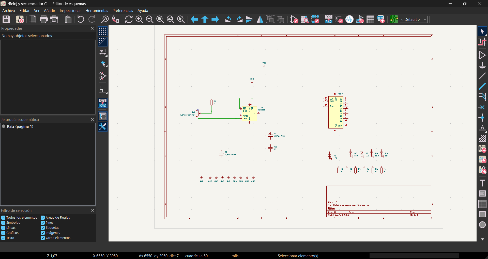
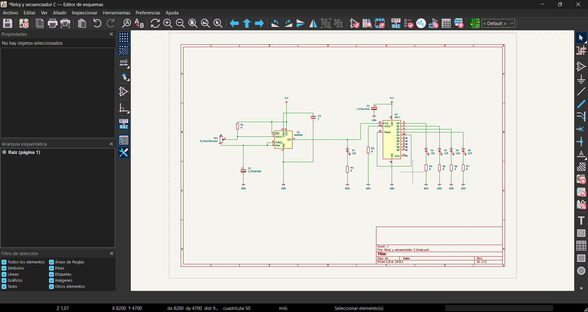
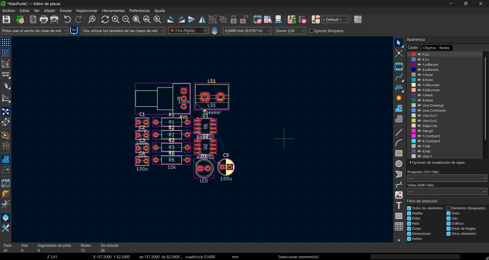
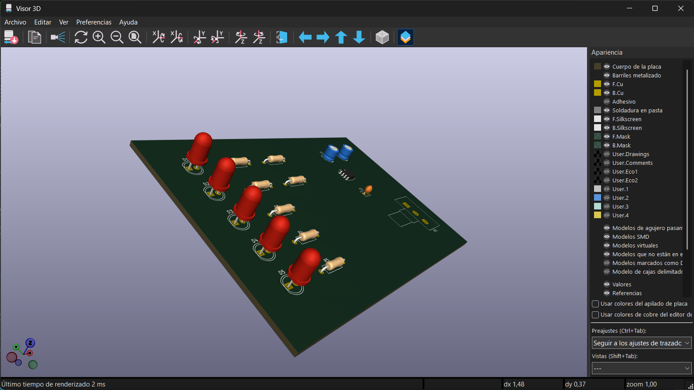
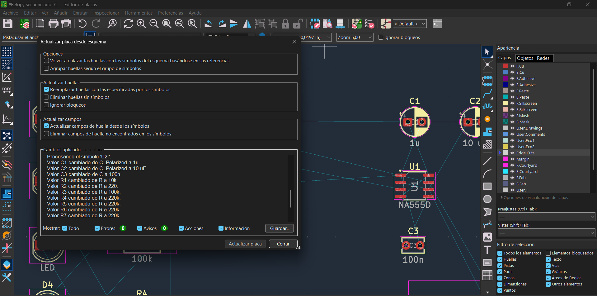
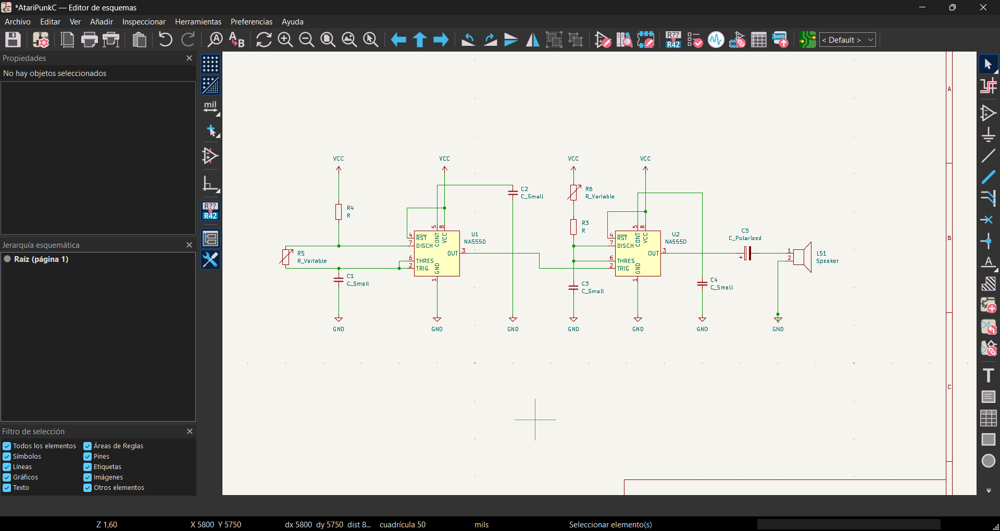
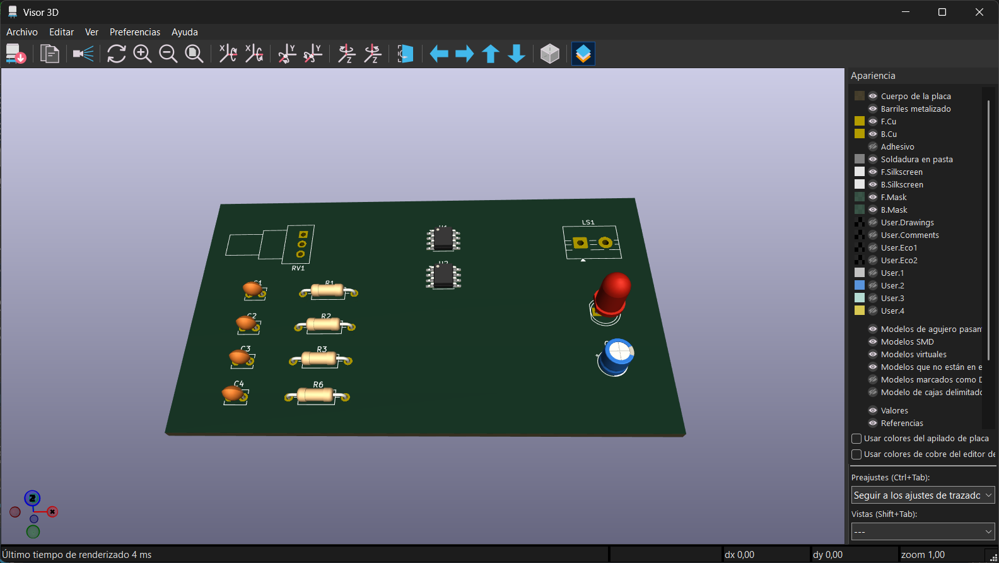

# sesion-08a

---

Finalmente volvemos con la transmisión habitual! para está ocasión tuvimos que tantear con el programa "KICAD"

Este es el programa en donde todos los anteriores esquemas y diagramas fueron hechos para nosotres y aun siendo un poco minimalista, es bastante entendible para alguien que nunca ha visto un programa similar.

---

<https://www.youtube.com/watch?v=w761LD5B2BQ>

*Cabe destacar que la clase fue grabada y utilice esto para repasar las cosas que me habia olvidado, pero por lo menos es intituitivo.*

## Proceso:

A la hora de buscar los componentes:

| Componente              |  Nombre en esquema              |
| ----------------------- | ------------------------------- |
| Resistencias            | `R`                             |
| Capacitores lenteja     | `C`                             |
| Capacitores polarizados | `C_Polarized`                   |
| Potenciómetro           | `R_Potenciometer`               |
| Ground (-)              | `GND`                           |
| Positivo (+)            | `VCC`                           |
| LED                     | `LED`                           |

Con todo dicho hice 3 cosas

La primera fue la practica a medias que hicimos en clases y las otras 2 son ejercicios ya vistos en clases.

No se si sea posible meter los archivos brutos en el Github, por lo tanto pondre un link externo de Google Drive proximamente (si es que me queda el espacio suficiente cueck)

<https://drive.google.com/drive/folders/13Nn-tBKvaI11vU3_Dm0W4bNu_r5YhqMW?usp=sharing>

En general todo llego a costarme 3 horas como mucho junto a la colocación en la placa 

Para hacer esto más facil, es poner todos los componentes a utilizar y darles una huella para luego solo copiar y pegar.

Luego de asignar y colocar todo, se da a guardar y pasamos al tema de la placa

este es del otro registro pero es para ver la interfaz de la siguiente parte, para crear la placa debemos bajar hasta la capa *Edge Cuts* y hacer el rectangulo que representara la pcb

Y tada!

Peeeeeeeeeeeeeeeeero, algo que descubrí es que si no puse los valores en el diagrama y ya ordene las cosas en la pcb, puedo volver al diagrama y actualizarlo. 
con ello todos los valores cambiaran en la PCB como magia :3 

Con todo eso, muestro el AtariPunk que hice en la semana de receso.

---

## Especificaciones

- Capacitor lenteja/Ceramico: Capacitor_THT:C_Disc_D3.8mm_W2.6mm_P2.50mm

- Resistencia: Resistor_THT:R_Axial_DIN0207_L6.3mm_D2.5mm_P10.16mm_Horizontal

- Capacitor con polaridad: Capacitor_THT:CP_Radial_D5.0mm_P2.50mm

- Led: LED_THT:LED_D5.0mm

- Potennciometro: Potentiometer_THT:Potentiometer_Alps_RK163_Single_Horizontal

*Estos si o si deben ser los componentes a usar o al momento de mandarlos a armar y soldar, seran diferente al resto, y por ello, causando confusión.*

---

Eso es por mi parte <3 Dino se despide por ahora.

Pd: El sebatoon me ayudo un poco con esto por llamada, loco pero cierto. :p gracias como siempre
