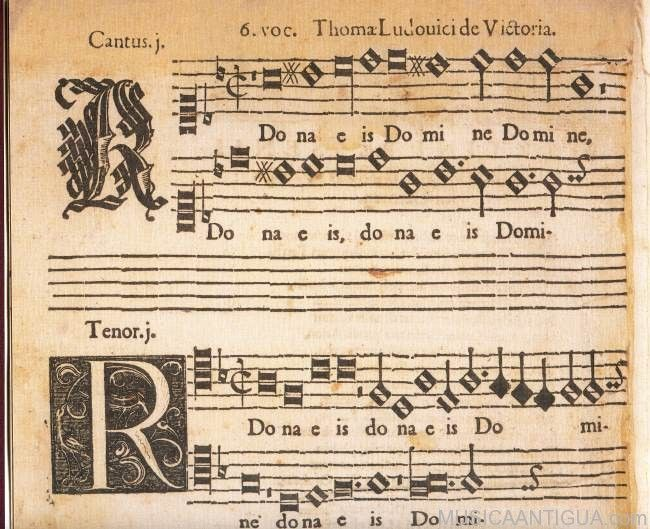
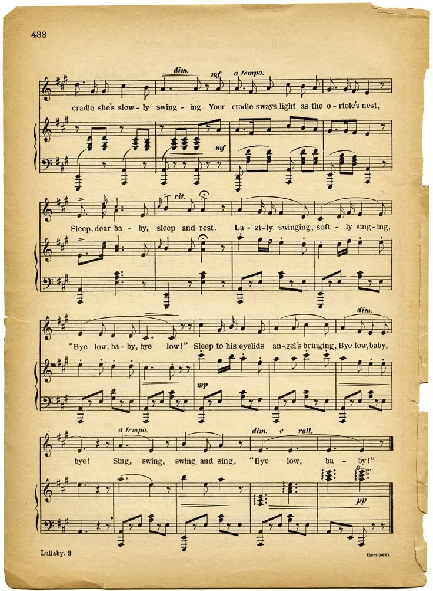
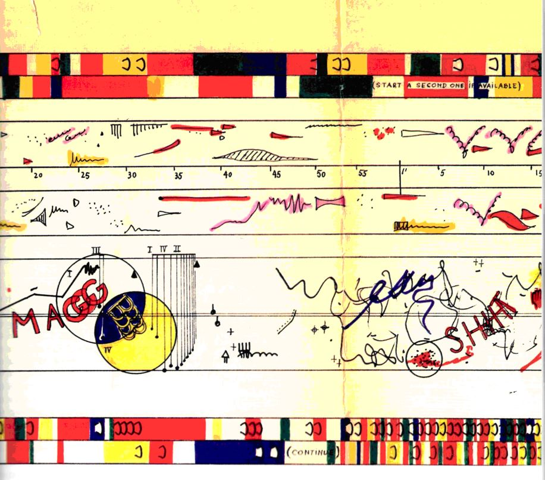
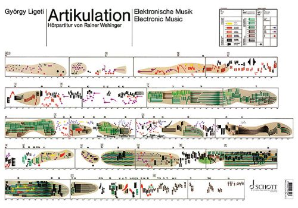

# sesion-13b

¿Que es una partitura?

Seh, estamos cuestionandonos algo que todes conocemos desde la basica. tu tipica regla de 5 lineas con una llave de sol y corcheas...blancas, negras y doble tempos

Para llegar a ese lenguaje, hay evolución.

Y para todo lenguaje, hay variaciones.

Tenemos cosas como instrucciones, dibujos, reglas, partituras, palabras, sonidos e interpretaciones de lo mismo, pero diferentes.

<https://blogthehum.com/2016/02/08/a-great-performance-of-steve-reichs-pendulum-music-1968/>

Esta interpretación es a partir de reglas:

La siguiente es mucho más expresiva:

<https://youtu.be/sJ9EZWBZee8?si=SXXWUU2L4tISLEjh&t=1684>

Y ni hablemos de otras:

¿Entonces que es una partitura realmente?

Muchas cosas.

Desde palabras hasta dibujos *Como el lenguaje mismo* 

SIEMPRE TAN POETICO ays (⁄ ⁄•⁄ω⁄•⁄ ⁄)

---

## Clases

- Hacer partituras

- Decidir definitivamente las placas a utilizar

- Materiales

| Componente                      | Cantidad | Precio (c/u) | Comprar                                                                                             |
| ------------------------------- | -------- | ------------ | --------------------------------------------------------------------------------------------------- |
| Chip 4069UBE                    | 1        | $1.100       | https://www.cabezacuadrada.cl/product/cd4069/                                                       |
| Chip CD40106BE                  | 3        | $750         | https://www.cabezacuadrada.cl/product/cd40106be/                                                    |
| Chip LM324                      | 1        | -            | -                                                                                                   |
| Potenciómetro 100K              | 8        | $490         | https://www.mechatronicstore.cl/potenciometro-rotacional-10k/                                       |
| Potenciómetro 250K              | 4        | $495         | https://altronics.cl/potenciometro-lineal-250k-b250k                                                |
| Capacitor no polarizado 100nF   | 6        | $100         | https://www.mechatronicstore.cl/condensadores-ceramicos-distintos-valores/                          |
| Capacitor no polarizado 10nF    | 1        | $100         | https://www.mechatronicstore.cl/condensadores-ceramicos-distintos-valores/                          |
| Capacitor polarizado 10uF 50V   | 6        | $100         | https://www.mechatronicstore.cl/condensador-capacitorio-de-electrolitico-por-unidad-varios-valores/ |
| Capacitor polarizado 0.22uF 50V | 1        | $100         | https://www.mechatronicstore.cl/condensador-capacitorio-de-electrolitico-por-unidad-varios-valores/ |
| Capacitor polarizado 100uF 50V  | 4        | $100         | https://www.mechatronicstore.cl/condensador-capacitorio-de-electrolitico-por-unidad-varios-valores/ |
| Capacitor polarizado 1uF 50V    | 1        | $100         | https://www.mechatronicstore.cl/condensador-capacitorio-de-electrolitico-por-unidad-varios-valores/ |
| Resistencia 100K                | 1        | $100         | https://www.mechatronicstore.cl/resistencias-electricas-1-2-w-1-unidad/                             |
| Resistencia 1K                  | 4 + 5*   | $200         | https://www.mechatronicstore.cl/resistencias-electricas-3w-por-unidad/                              |
| Diodo 1N4007                    | 2        | $200         | https://www.mechatronicstore.cl/diodo-rectificador-in4007-1n4007-4007/                              |
| LED 3mm/5mm                     | 5        | $100         | https://www.mechatronicstore.cl/led-3mm-5mm/                                                        |
| Regulador de voltaje L7805      | 2        | $490         | https://www.mechatronicstore.cl/regulador-limitador-de-voltaje-5v-dc/                               |
| Chip CD4070BE                   | 1        | -            | https://www.mouser.cl/ProductDetail/Texas-Instruments/CD4070BE?qs=5WY7Uqh921w5Ya0dPgjorQ%3D%3D      |
| Barrel Jack Switch              | 6        | —            | Extraídos del LID                                                                                   |
| Switch 2 pines, 2 posiciones    | 2        | $570         | https://www.katode.cl/switches/1339-interruptor-switch-2-pines-on-off-corto.html                    |
| Audio Jack                      | 3        | -            | -                                                                                                   |

Una de las partituras la hicimos con la Vania y la siguiente ya es más propia del video largo y loco.

La Cata menciono el movimiento de las abejas "animadas" y que usemos eso ya que suena locochón...algo más para la lista

y ya para el martes. SOLDAR.

Yo quiero soldar, vine por eso y quiero eso AAAAAAAAAAAAAAAAAAAAAAAHG.

La ultima vez que soldamos con la Daya no salió muy bien que digamos y quiero redimirme.

---

¿Dónde quieren pasar la eternidad?

(una piedra en Gales)

### POMELO

- PIEZA DE ILUMINACIÓN 

Encender un fósforo y vigilar hasta que se consuma.

(Me gusta hacer eso cuando hay apagones, porque no hay muchas más cosas para mirar y es efimero)

PIEZA DE CONVERSACIÓN

Vendarse una parte del cuerpo.

Si la gente pregunta, inventar un cuento
y contarlo.

Si la gente no pregunta, llamarles
la atención sobre el vendaje y contarles

Si la gente se olvida, recordarles
y seguir contando.

No hablar de ninguna otra cosa.

(Que decir...mejor no jugar con estas cosas, a veces suceden cosas más reales y es mejor no bromear)

- PIEZA DE PAPEL PLEGADO

Plegar ciertas partes de un papel y leer.

Plegar una grúa y leer.

(De las ideas más locas, salen mejores resultados, o más locos y creativos...lo malo es que no puedo plegar una grúa)

РОЕМА ТАСTIL PARA GRUPO DE GENTE

Tocarse unos a otros.

(lo que nos hace ser reales son nuestros sentimientos y nuestros cuerpos. aunque da miedo pensar en tocar gente. puede que no sean reales)
