# sesion-09b

## KiCad pt3: El regreso ##

Se inicio con una revisión de dudas generales, donde lo que más rescato es la nomenclatura de los chips o tambien llamados IC

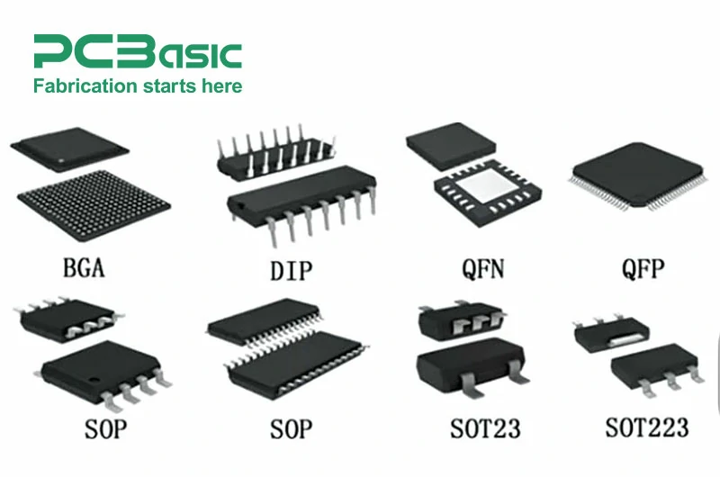

> Nosotros estamos trabajando con los tipo DIP

 

Otro punto fue la distinción de los botones, donde tenemos _push botton_ y _switch_

- Push botton: Existen los NO (Normally Open) y NC (Normally Close), estos se diferencian en cual es el estado que se mantiene como base (sin presionar)

> Los NO son los más comunes, que la energía solo fluye al presionar. En cambio los NC al presionar se detiene el flujo de electrones

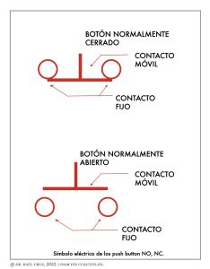

 

- Switch:  A diferencia de los botones, estos recuerdan el estado en el que se los deja, existen diversas configuraciones

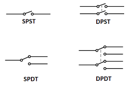

> S: Single / Único
>
> D: Double / Doble
>
> P: Pole / Polo
>
> T: Throw / Tiro 

 

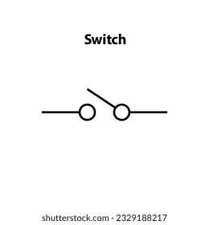

> Tanto PushBotton como Switchs SPST se pueden representar con el mismo símbolo

 

### Edición de huellas, símbolos y modelos 3D ###

#### Símbolo ####

1. Seleccionamos nuestro símbolo a editar, es importante que este sea solo en el proyecto (queremos evitar romper algo dentro de los archivos de KiCad xd)

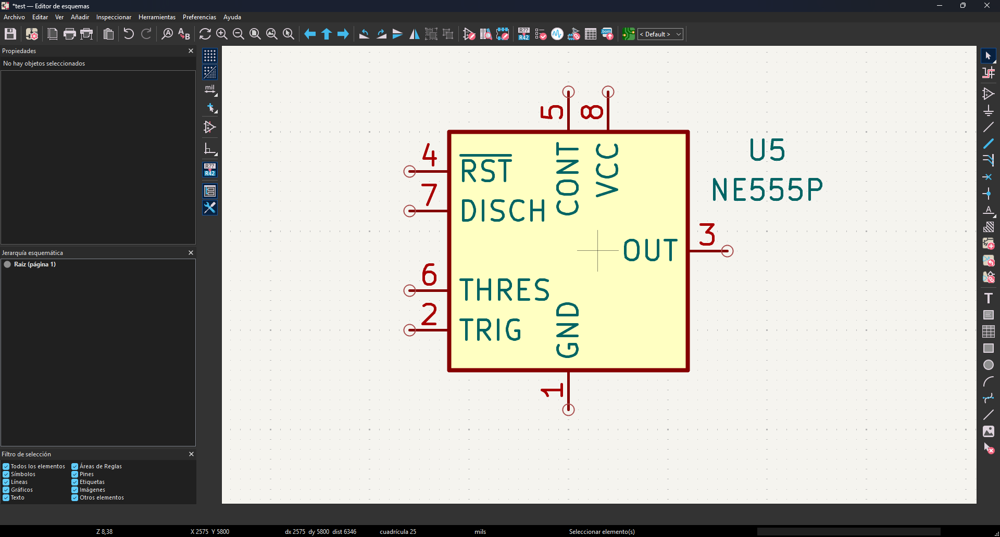

 

2. Editamos (_E_) y seleccionamos _"Editar Símbolo"_

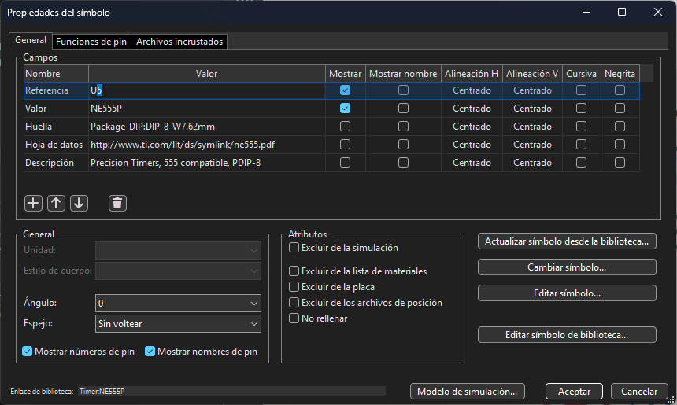

 

3. Se nos va abrir un menú, acá ordenamos según nuestras preferencias

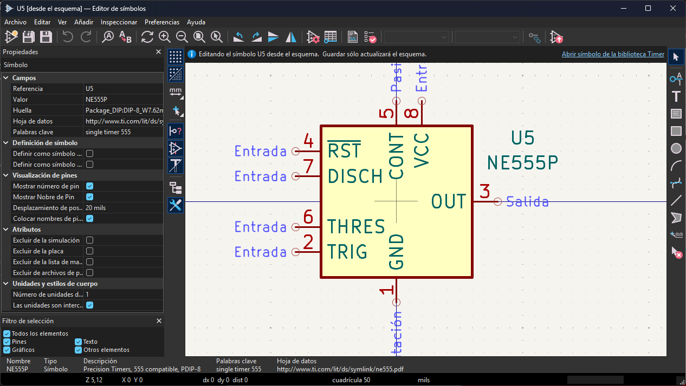

 

4. Guardamos con _CTRL_ + _S_ y cerramos

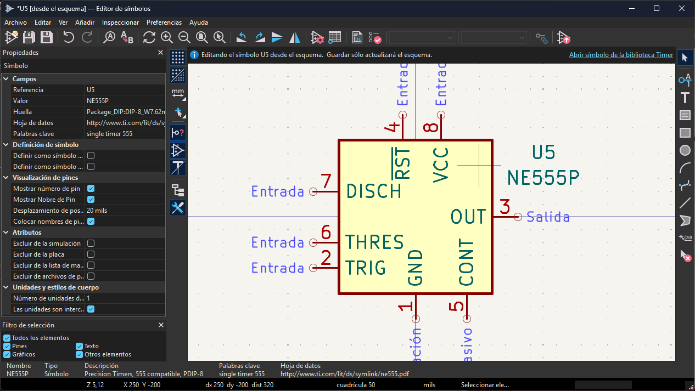

 

#### Huellas ####

---

De momento no realizaremos cambios en las huellas, dado que al tener relación con el espacio físico podemos embarrarla xd

---

#### Modelo 3D ####

Es importante saber que el principal archivo que soporta KiCad es el _.step_

1. Abrimos el archivo _.kicad_pcb_ y seleccionamos el elemento que le queremos cargar un modelo 3D

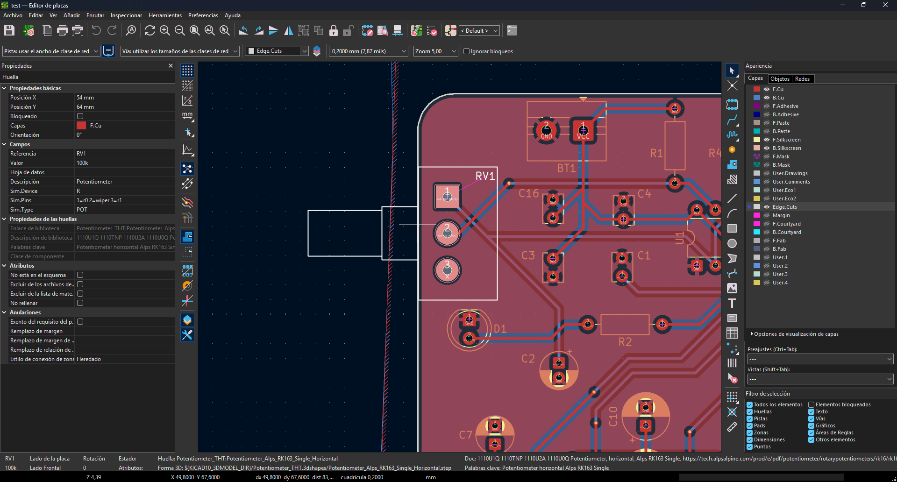

 

2. En esta ventana elegimos la opción de Modelo 3d

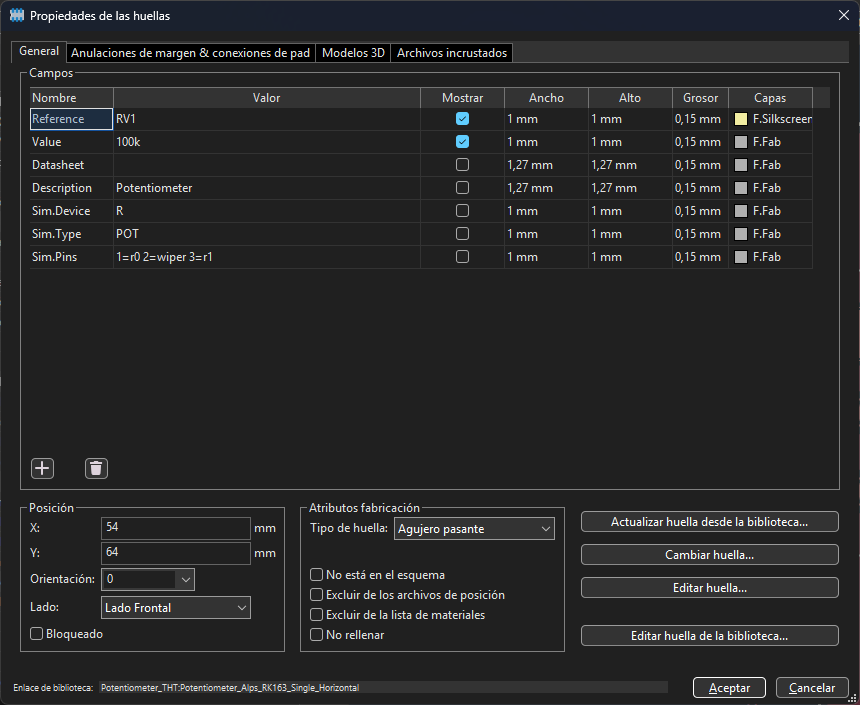

 

3. Ahora seleccionamos la ruta al archivo que utilizaremos

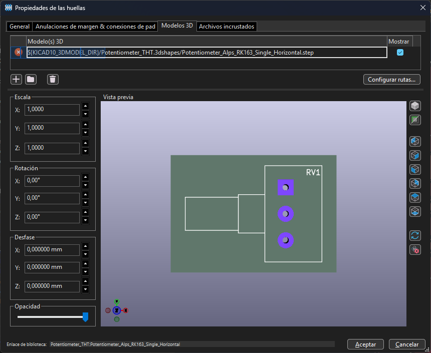

 

4. Con el modelo cargado nos queda ordenarlo para que calce, esto con las opciones al costado izquierdo

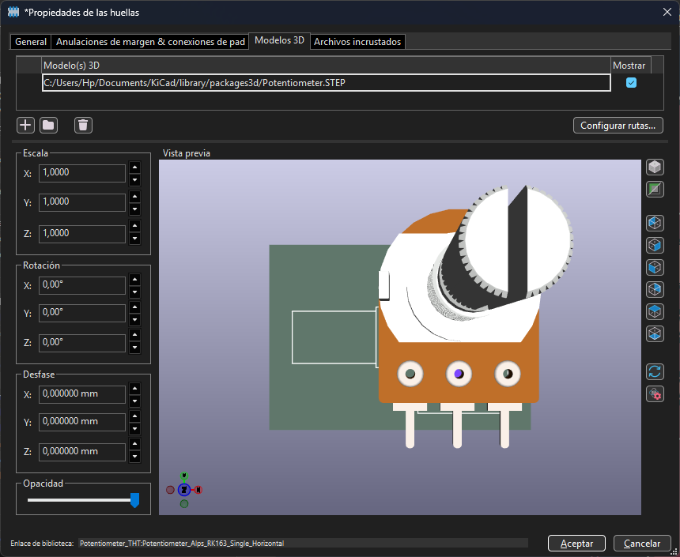

 

5.  Listo, ahora guardamos y sería todo

   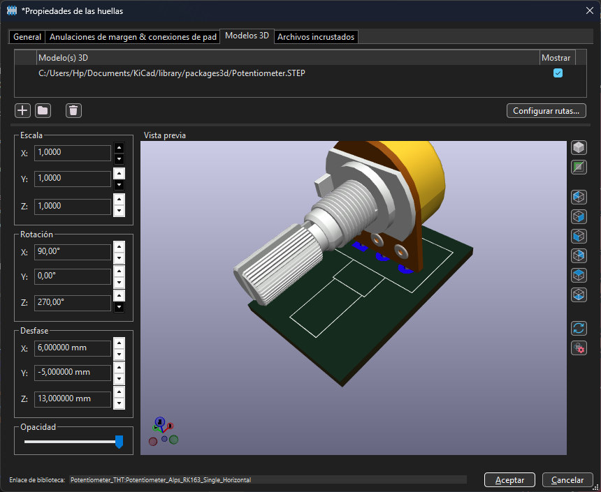

   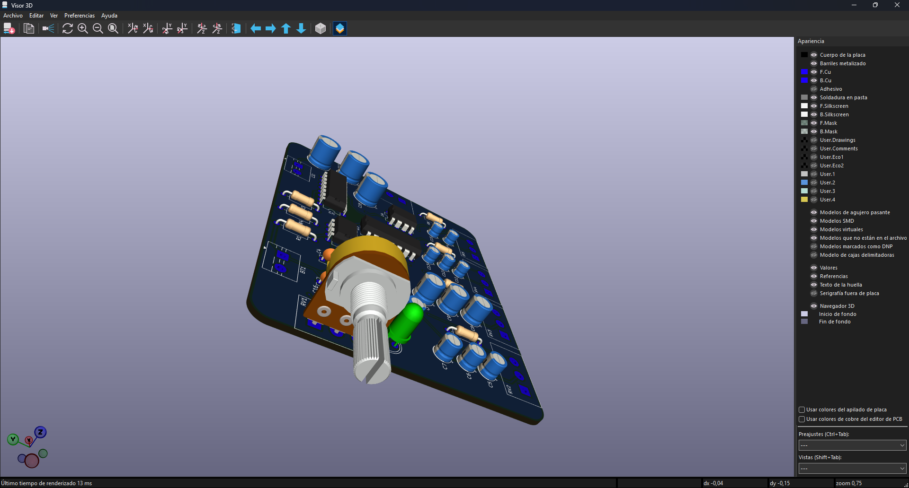

 

---

En caso de los Terminal Block, existe un pequeño error al momento de cargar la ruta del modelo 3D de estos, por parte de KICad

- _ ${KICAD10_3DMODEL_DIR}/TerminalBlock_Phoenix.3dshapes/TerminalBlock_Phoenix_MKDS-1,5-2-5.08_1x02_P5.08mm_Horizontal.step_

> Copiar y pegar en caso de utilizar un TB de 2 pin
>
> > Si se utiliza otro de mayor cantidad, tomarlo como referencia para ubicar los demás

---

 

## Investigación Secunciador ##

Para el proyecto 2 se va a trabajar un secuenciador (queriamos VCO, pero camarón que se duerme, se lo lleva la corriente), en este se deben fabricar y diseñar 2 versionas, para poder combinarlos con otros elementos como VCO, Clock, etc...

Por lo que como primer punto es entender que hace un **_Secuenciador_**:

 Según lo que entiendo, consta de recibir una corriente única y dividirla en diversos canales o _steps_ (es importante entender que esta división debe ocurrir con cierto orden, es decir circule corriente por cada _step_ al mismo tiempo, puesto que no tendría mucho sentido), los cuales al llegar a un VCO serán modificadas para obtener el sónido que se quiera. Por lo que si queremos experimentar debemos buscar chips que cumplan la misma lógica.

 Además, si analizamos el IC utilizado anteriormente tenía un nombre particular _"contador de dácadas"_, esto nos puede dar una pista por donde buscar.

### Primaras Busquedas ###

1. En lo personal me enfoque en identifcar IC que nos puedan ayudar a realizar este proyecto, más que como modificar el CD4017, por lo que mi primera busqueda fue simple pero fúncional

- "_chip similar al 4017_"

> Confie demasiado en el motor de busqueda la verdad, no esperaba encontrar algo donde dijera textualmente algún chip
>
>> <https://www.quora.com/Is-there-any-equivalent-chip-for-IC-4017-used-in-a-frequency-divider-circuit-using-a-555-timer>

Acá recomiendan el **CD4022**, la gran diferencía que posee es que este cuenata con 8 salidas, 2 menos que el _4017_, no es mucha diferencia, pero ya empezamos a tener algo de información relevante

 

2. Siguiendo esta lógica de buscar similitudes del chip 4017 en otros, llegamos a la busqueda de **contadores**, apareciendo el **_4520_**, un contador bínario (Lo que puede dar un resultado interesante, dado el patrón de repeteción que poseen la secuencia bínaria)

   > De momento el único binarismo que me está gustando

 
   
3. Encontré el siguiente Blog <https://djjondent.blogspot.com/2017/08/cmos-useful-chips-for-lunetta-synths.html?m=1>

En el aparece listada la familia de chips CD40000, por lo que dejo los que más me llamaron la atención para futura investigación (Próxima sesión)

- 4510 ➙ Up/Down Counter

> <https://www.build-electronic-circuits.com/4000-series-integrated-circuits/ic-4510/>

- 4006 ➙ Digital Noise Generator

> <https://www.modwiggler.com/forum/viewtopic.php?t=142670>

- **4022** ➙ Contador Bínario / Recomiendo totalmente ver el video adjunto

  > <https://www.youtube.com/watch?v=5Trjze02Wm4>

- 4013

- 4020

- 74LS90

 

### Pagínas de referencia ###

+ <https://www.youtube.com/watch?v=7lM8bY7qF8U>  (UTILIZA TRANSISTORES PARA LOS LED) 

+ <https://www.quora.com/Is-there-any-equivalent-chip-for-IC-4017-used-in-a-frequency-divider-circuit-using-a-555-timer>

+ <https://audiomaquinas.com/86-sintetizadores-diy/>

+ <https://www.birthofasynth.com/Scott_Stites/Pages/Klee_Birth.html>
    
+ <https://djjondent.blogspot.com/2017/08/cmos-useful-chips-for-lunetta-synths.html?m=1>

+ <https://www.youtube.com/watch?v=2KUbxQgD6hk>
