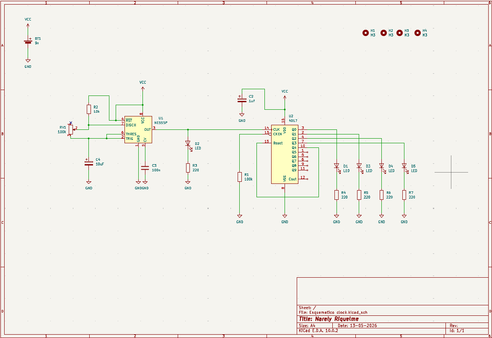
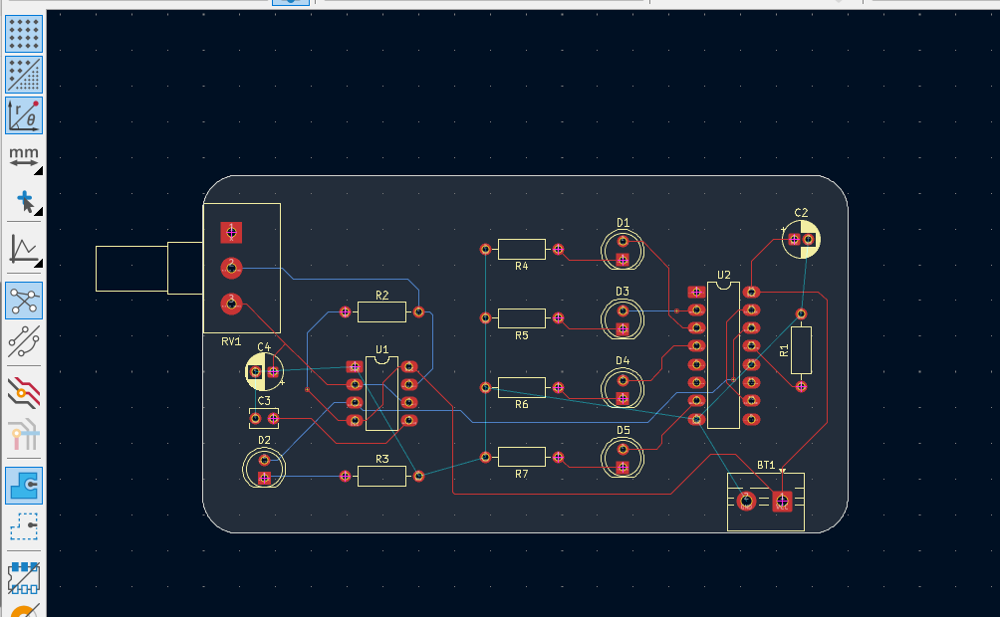
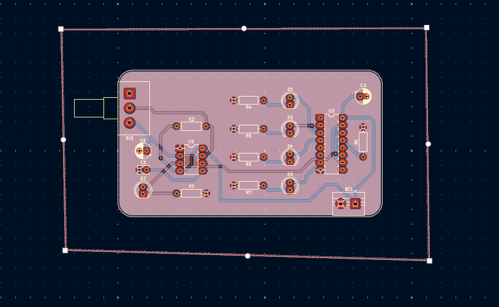
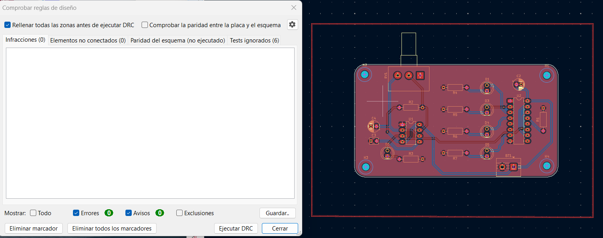

# sesion-09a
## 12, may
### Apuntes
Esta clase fue online y Missa nos explicó más a profundidad cómo crear la PCB que, a mi parecer, es lo más difícil de hacer; por eso voy a detallar los pasos que explicó Missa:

1. Lo primero que debemos tener en cuenta son las capas en las que debemos trabajar, resumen de las más importantes:
* Edge.Cuts: placa
* F.Cu: dibujar cables en la parte frontal
* B.Cu: para los cables en la parte de atrás
* User.1: para dibujar líneas de referencia temporales
* F.Silkscreen: para dibujar en la placa

2. En la capa Edge.Cuts se puede trabajar con la placa creando una desde cero, dibujando un rectángulo o puede ser cualquier otra forma a la imaginación.

3. Distribuir los componentes que te arroja de las huellas del esquemático de manera libre, siempre con buenas prácticas de diseño, ya sea colocar para arriba los VCC y abajo los GND, o a la izquierda la entrada y a la derecha la salida, como ejemplos.

4. Después de tener todos los componentes organizados empieza la colocación de todos los cables, puntos claves:
* Se aprieta la "x" para colocar una pista y se puede colocar en la capa F.Cu o B.Cu, que sería para dibujar en la parte frontal y la posterior de la placa, y
* Otra cosa a tener en cuenta son las vías, que sirven para pasar de un lado al otro de la placa en la misma pista; se tiene que apretar la "v" y se crea una vía, se puede modificar el tamaño y se recomienda que sean de 0.5 mm de diámetro y de 0.3 mm de orificio.
* Se conectan solos los que van a VCC.

5. Para GND lo que se hace es, en vez de colocar cables, se convierte toda la placa en GND y se hace con la herramienta que se llama "dibujar zonas rellenas"; se coloca en las opciones rellenar en capas y en el nombre de la red GND, y después se dibuja el contorno alrededor de la placa y fijarse que quede bien cerrado, y para terminar apretar la tecla "B".
   
6. Ya un último paso sería verificar que no tenga errores la placa apretando "comprobar reglas de diseño", y si hay errores que no entendemos, preguntar a Misa :)

7. Como extra es agregar los hoyitos que van en la placa para poder colocarles un perno de 3mm, se colocan como componentes con su huella igual.

### Enacargo esquematico y pcb en kitcad
Primera parte: Aquí hice los esquemáticos por separado del Clock y el Secuenciador. Esta parte no se me hizo tan complicada, solo las huellas, que es más difícil encontrar el componente exacto entre tantos otros.

+ Aqui junte los esquematicos en uno para poder hacer una sola placa

---
Segunda parte: Aquí muestro los resultados de la PCB terminada. Aquí logré hacer bien la placa, no tuve mayores complicaciones y la clase grabada me ayudó bastante para ir resolviendo dudas. Siento que es un poco difícil de entender al principio, ya que hay varias reglas y cosas que aún no entiendo bien, pero con práctica todo se logra.

+ Aquí fui a revisar si lanzaba algún error y, por suerte, todo salió bien; solo lanzó avisos, los mismos que a Missa, entonces solo los omití.

### Encargo lectura de libro de Flusser, capítulo 1
Lo que entendi de Flusser es que las fotos nos engañan porque parecen la realidad, pero no lo son. la realidad es que son imágenes creadas por la cámara, que ya tiene sus propias reglas. Cuando sacas una foto, crees que tú mandas, pero solo haces lo que la máquina te deja hacer. La cámara ya viene programada y nosotros solo somos como "operadores" de ese programa. Antes los dibujos los hacía el ojo humano, ahora las fotos las hacen fórmulas de científicos. Es peligroso porque nos creemos todo lo que vemos en una pantalla sin pensar quién lo armó y mas ahora si contamos con la inteligencia artificial que literal puede modificar cualquier imagen alterando la realidad. Al final, su filosofía es para que no seamos simples piezas de la tecnología.

