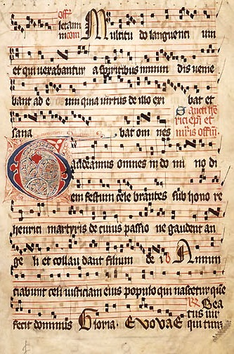

# sesion-13a

12-06-2026

## Apuntes de clase

Profe Misa muestra discos nuevos que ha estado escuchando en Instagram o en blogs.

Y, a final de mes, los pasa a tablas de Markdown.

Si hablamos de partituras, hablamos del canto gregoriano.

¿Qué me indica?

Hay unas letras que se leen en cierta sucesión.

Luego nos mostró los corales

y vimos varias partituras

### Semiótica

La semiótica (o semiología) es la disciplina que estudia los signos, los símbolos y los sistemas de comunicación humana. Analiza cómo construimos, transmitimos e interpretamos significados más allá de las palabras, abarcando imágenes, gestos, colores, sonidos y comportamientos.

---

Partitura de gamelan 

Hay muchas obras de jhon cage donde destruia su ego en la composición y faltaba al respeto totalmente al piano

Muestra de como

---

Avance en clases

makerworld, pagina donde hay modelos 3D donde se pueden editar los parametros

Evaluamos y tenemos en cuanta la posibilidad de mezclarlo con un concepto mas de naturaleza donde apliquemos semillas de chia en donde talvez usemos sensores de proximidad o las resistencias LDR para generar una istrucción de partitura de salir y ponerse debajo de un arbol en un día soleado, cosa que haria sonar variado el resultado

y hablando con misa podemos utilizar nuestras propias resistencias
