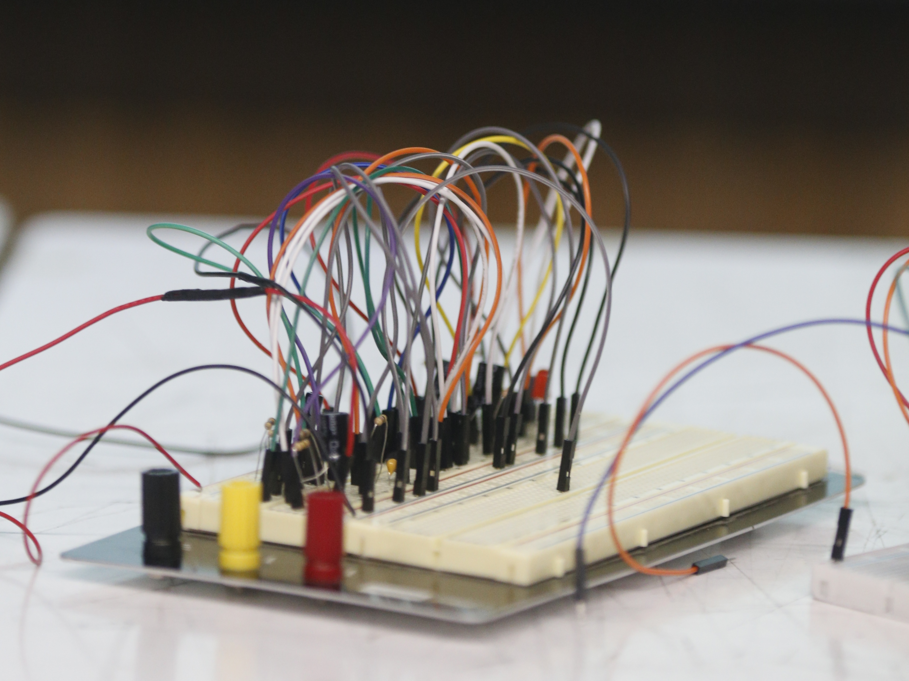

# sesion-12b

# Apuntes clase? algo así 

Esta sesión fue la entrega del proyecto 02!! personalmente la pasé muy bien ya que el ambiente en las presentaciones de este taller siempre es muy agradable (al igual que todos los días), por lo que me siento muy cómodo en estas instancias.

Cuando terminamos de presentar Misa nos mencionó que podríamos sacar el circuito del chip 4017 que habíamos incluído en el piezo 01, y que podríamos usar el pin de salida del 555 para poder conectarnos a otros módulos y así nos ahorramos espacio en la pcb!! ya que tuvimos que hacer la pcb del tamaño máximo y aún así nos costó el poder hacer las pistas ya que estaba todo lleno :'v y respecto al piezo 02, este fue descartado ya que no funciona como esperabamos que lo hiciera XDD momazos piezo like para más 

Como estuvimos en presentaciones no hay fotos de avances, pero si fotos que tomó Emi!! aquí dejo dos fotitos jiji:

